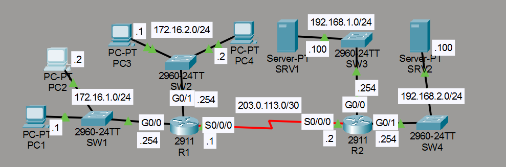
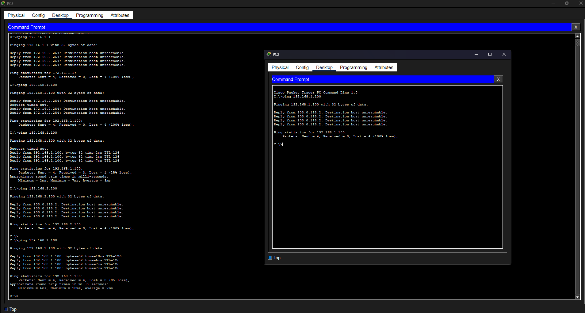

# Laboratorio: Standard ACLs — Day 34 Lab

## Descripción general

En este laboratorio se configuran **ACLs (Access Control Lists)** estándar para restringir el tráfico entre diferentes redes. Se utilizan ACLs numeradas en R1 y ACLs con nombre en R2. También se configura OSPF para que los routers tengan conectividad completa antes de aplicar los filtros.

## Topología



La red consta de dos routers conectados por un enlace serial:

- **R1**: Redes `172.16.1.0/24` (g0/0) y `172.16.2.0/24` (g0/1)
- **R2**: Redes `192.168.1.0/24` (g0/0) y `192.168.2.0/24` (g0/1)
- **Enlace serial**: `203.0.113.0/30`

## Políticas de red

1. Solo PC1 (172.16.1.1) y PC3 (172.16.2.1) pueden acceder a la red `192.168.1.0/24`
2. Los hosts de `172.16.2.0/24` no pueden acceder a `192.168.2.0/24`
3. `172.16.1.0/24` no puede acceder a `172.16.2.0/24`
4. `172.16.2.0/24` no puede acceder a `172.16.1.0/24`

## Configuración de OSPF

Se configura OSPF en ambos routers para que todas las redes sean visibles. Las interfaces LAN se configuran como pasivas.

### R1

```cisco
R1(config)#router ospf 1
R1(config-router)#network 203.0.113.0 0.0.0.3 area 1
R1(config-router)#network 172.16.0.0 0.0.255.255 area 1
R1(config-router)#passive-interface g0/1
R1(config-router)#passive-interface g0/0
```

### R2

```cisco
R2(config)#router ospf 2
R2(config-router)#network 203.0.113.0 0.0.0.3 area 1
R2(config-router)#network 192.168.0.0 0.0.255.255 area 1
R2(config-router)#passive-interface g0/1
R2(config-router)#passive-interface g0/0
```

## Configuración de ACLs en R1

Se usan ACLs numeradas (estándar) aplicadas a la salida de las interfaces LAN.

### Bloquear 172.16.1.0/24 hacia 172.16.2.0/24 (ACL 1)

Se aplica en G0/1 (interfaz hacia la red 172.16.2.0/24) para denegar el tráfico proveniente de 172.16.1.0/24.

```cisco
R1(config)#access-list 1 deny 172.16.1.0 0.0.0.255
R1(config)#access-list 1 permit any
R1(config)#interface g0/1
R1(config-if)#ip access-group 1 out
```

### Bloquear 172.16.2.0/24 hacia 172.16.1.0/24 (ACL 2)

Se aplica en G0/0 (interfaz hacia la red 172.16.1.0/24) para denegar el tráfico proveniente de 172.16.2.0/24.

```cisco
R1(config)#access-list 2 deny 172.16.2.0 0.0.0.255
R1(config)#access-list 2 permit any
R1(config)#interface g0/0
R1(config-if)#ip access-group 2 out
```

## Configuración de ACLs en R2

Se usan ACLs con nombre (named standard ACL) aplicadas a la salida de las interfaces LAN.

### Permitir solo PC1 y PC3 hacia 192.168.1.0/24 (BLOCK_JAVIER)

Se aplica en G0/0, dirección de salida hacia la red 192.168.1.0/24. Solo se permiten las IPs específicas de PC1 y PC3.

```cisco
R2(config)#ip access-list standard BLOCK_JAVIER
R2(config-std-nacl)#permit 172.16.1.1
R2(config-std-nacl)#permit 172.16.2.1
R2(config-std-nacl)#deny any
R2(config-std-nacl)#remark ## CONFIGURED BY JAVIER ##
R2(config-std-nacl)#interface g0/0
R2(config-if)#ip access-group BLOCK_JAVIER out
```

### Bloquear 172.16.2.0/24 hacia 192.168.2.0/24 (BLOCK_JEREMY)

Se aplica en G0/1, dirección de salida hacia la red 192.168.2.0/24.

```cisco
R2(config)#ip access-list standard BLOCK_JEREMY
R2(config-std-nacl)#deny 172.16.2.0 0.0.0.255
R2(config-std-nacl)#permit any
R2(config-std-nacl)#remark ## CONFIGURED BY JEREMY ##
R2(config-std-nacl)#interface g0/1
R2(config-if)#ip access-group BLOCK_JEREMY out
```

## Pruebas de conectividad

Se verifican las restricciones haciendo ping desde diferentes orígenes hacia los destinos bloqueados.



## Resumen de comandos

| Comando                                                  | Descripción                                         |
| -------------------------------------------------------- | --------------------------------------------------- |
| `access-list <numero> deny <red> <wildcard>`              | Crea una ACL numerada con regla deny                |
| `access-list <numero> permit any`                        | Permite todo el tráfico restante                    |
| `ip access-group <numero> out`                           | Aplica la ACL a la salida de una interfaz           |
| `ip access-list standard <nombre>`                       | Crea una ACL estándar con nombre                    |
| `permit <host>`                                          | Permite una dirección IP específica                 |
| `deny <red> <wildcard>`                                  | Deniega una red                                     |
| `remark <texto>`                                         | Agrega un comentario a la ACL                       |
| `passive-interface <interfaz>`                           | Desactiva el envío de actualizaciones OSPF en una interfaz LAN |
