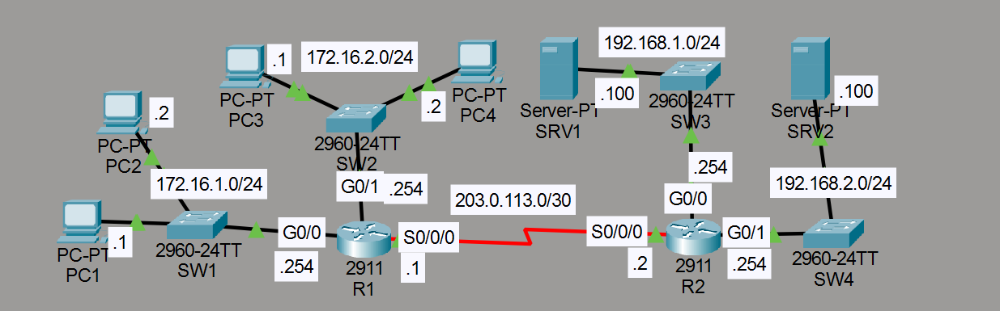

# Laboratorio: Extended ACLs

## Descripción general

En este laboratorio se configuran **ACLs extendidas** en R1 para filtrar tráfico según el protocolo, dirección IP de origen, dirección IP de destino y puerto. A diferencia de las ACLs estándar, las extendidas permiten un control mucho más específico.

## Topología



La red consta de:

- **R1**: Red `172.16.1.0/24` (g0/0) con PC1 (172.16.1.1), Red `172.16.2.0/24` (g0/1)
- **R2**: Red `192.168.1.0/24` con SRV1 (192.168.1.100 — DNS), Red `192.168.2.0/24` con SRV2 (192.168.2.100 — HTTP/HTTPS)
- **Enlace serial**: R1 s0/0/0 — R2

## Políticas de red

1. Los hosts de `172.16.2.0/24` no pueden comunicarse con PC1 (172.16.1.1)
2. Los hosts de `172.16.1.0/24` no pueden acceder al servicio DNS (puerto 53 UDP) en SRV1 (192.168.1.100)
3. Los hosts de `172.16.2.0/24` no pueden acceder a los servicios HTTP (puerto 80) ni HTTPS (puerto 443) en SRV2 (192.168.2.100)

## Configuración de ACLs extendidas en R1

### Bloquear 172.16.2.0/24 hacia PC1 (Block_Javier)

Se aplica en G0/1 en dirección **in** (el tráfico que entra desde la red 172.16.2.0/24).

```cisco
R1(config)#ip access-list extended Block_Javier
R1(config-ext-nacl)#deny ip 172.16.2.0 0.0.0.255 host 172.16.1.1
R1(config-ext-nacl)#permit ip any any
R1(config-ext-nacl)#interface g0/1
R1(config-if)#ip access-group Block_Javier in
```

### Bloquear DNS desde 172.16.1.0/24 hacia SRV1 (Block_Jeremy)

Se aplica en G0/0 en dirección **in** (el tráfico que entra desde la red 172.16.1.0/24).

```cisco
R1(config)#ip access-list extended Block_Jeremy
R1(config-ext-nacl)#deny udp 172.16.1.0 0.0.0.255 host 192.168.1.100 eq 53
R1(config-ext-nacl)#permit ip any any
R1(config-ext-nacl)#interface g0/0
R1(config-if)#ip access-group Block_Jeremy in
```

### Bloquear HTTP/HTTPS desde 172.16.2.0/24 hacia SRV2 (Block_Koke)

Se aplica en S0/0/0 en dirección **out** (el tráfico que sale hacia el enlace serial, es decir, hacia R2).

```cisco
R1(config)#ip access-list extended Block_Koke
R1(config-ext-nacl)#deny tcp 172.16.2.0 0.0.0.255 host 192.168.2.100 eq 80
R1(config-ext-nacl)#deny tcp 172.16.2.0 0.0.0.255 host 192.168.2.100 eq 443
R1(config-ext-nacl)#permit ip any any
R1(config-ext-nacl)#interface s0/0/0
R1(config-if)#ip access-group Block_Koke out
```

## Resumen de políticas y ACLs

| ACL            | Dirección | Interfaz | Regla                                                                 |
| -------------- | --------- | -------- | --------------------------------------------------------------------- |
| Block_Javier   | in        | g0/1     | Denegar todo IP desde 172.16.2.0/24 hacia 172.16.1.1                  |
| Block_Jeremy   | in        | g0/0     | Denegar UDP desde 172.16.1.0/24 hacia SRV1 puerto 53 (DNS)            |
| Block_Koke     | out       | s0/0/0   | Denegar TCP desde 172.16.2.0/24 hacia SRV2 puertos 80 (HTTP) y 443 (HTTPS) |

## Comparativa: ACL estándar vs extendida

| Característica        | ACL estándar                       | ACL extendida                                  |
| --------------------- | ---------------------------------- | ---------------------------------------------- |
| Filtra por            | Solo dirección IP de origen        | Origen, destino, protocolo y puerto            |
| Número de rango       | 1-99, 1300-1999                    | 100-199, 2000-2699                             |
| Precisión             | Baja                               | Alta                                           |
| Ubicación recomendada | Cerca del destino                  | Cerca del origen                               |

## Resumen de comandos

| Comando                                                    | Descripción                                           |
| ---------------------------------------------------------- | ----------------------------------------------------- |
| `ip access-list extended <nombre>`                         | Crea una ACL extendida con nombre                     |
| `deny ip <origen> <wildcard> <destino>`                    | Deniega tráfico IP completo                           |
| `deny udp <origen> <wildcard> <destino> eq <puerto>`      | Deniega tráfico UDP hacia un puerto específico        |
| `deny tcp <origen> <wildcard> <destino> eq <puerto>`      | Deniega tráfico TCP hacia un puerto específico        |
| `permit ip any any`                                        | Permite el resto del tráfico                          |
| `ip access-group <nombre> <in\|out>`                       | Aplica la ACL a una interfaz en una dirección         |
