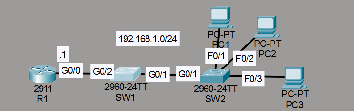
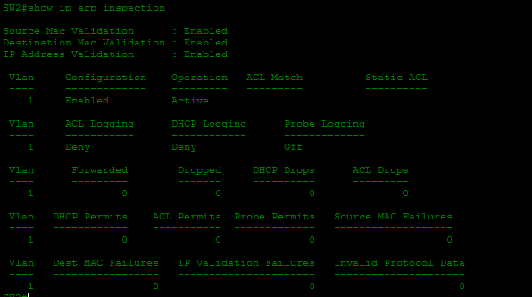
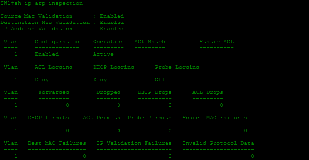

# Laboratorio: Dynamic ARP Inspection — Day 51 Lab

## Descripción general

En este laboratorio se configura DHCP Snooping y **DAI (Dynamic ARP Inspection)** para proteger la red frente a respuestas ARP falsas. DHCP Snooping crea una tabla de asociaciones IP-MAC que DAI utiliza para validar los paquetes ARP.

## Topología



R1 funciona como servidor DHCP. SW1 y SW2 protegen la VLAN 1 mediante DHCP Snooping y DAI.

## 1. Configurar R1 como servidor DHCP

Se reservan las direcciones `192.168.1.1` a `192.168.1.9` para asignaciones estáticas.

```cisco
R1(config)#ip dhcp excluded-address 192.168.1.1 192.168.1.9
R1(config)#ip dhcp pool POOL1
R1(dhcp-config)#network 192.168.1.0 255.255.255.0
R1(dhcp-config)#default-router 192.168.1.1
```

## 2. Configurar DHCP Snooping

DHCP Snooping se activa en la VLAN 1. Los puertos conectados a routers o switches se marcan como confiables (`trust`).

### SW2

```cisco
SW2(config)#ip dhcp snooping
SW2(config)#ip dhcp snooping vlan 1
SW2(config)#int g0/1
SW2(config-if)#ip dhcp snooping trust
SW2(config)#no ip dhcp snooping information option
```

### SW1

```cisco
SW1(config)#ip dhcp snooping
SW1(config)#ip dhcp snooping vlan 1
SW1(config)#int g0/2
SW1(config-if)#ip dhcp snooping trust
SW1(config)#no ip dhcp snooping information option
```

La tabla de DHCP Snooping se utiliza posteriormente para validar las direcciones IP y MAC de los dispositivos.

## 3. Configurar Dynamic ARP Inspection

DAI comprueba que la información de los paquetes ARP coincide con la tabla creada por DHCP Snooping. Se habilitan las validaciones de MAC de origen, MAC de destino y dirección IP.

### SW2

```cisco
SW2(config)#ip arp inspection vlan 1
SW2(config)#interface g0/1
SW2(config-if)#ip arp inspection trust
SW2(config)#ip arp inspection validate src-mac dst-mac ip
```



### SW1

```cisco
SW1(config)#ip arp inspection vlan 1
SW1(config)#int range g0/1-2
SW1(config-if-range)#ip arp inspection trust
```



## Trusted Ports

Los puertos conectados a un router o a otro switch se configuran como trusted porque pueden recibir tráfico DHCP y ARP legítimo de otros dispositivos de red. Los puertos hacia usuarios finales deben permanecer sin confianza para que sus paquetes sean inspeccionados.

## Resumen de comandos

| Comando | Descripción |
| --- | --- |
| `ip arp inspection vlan <id>` | Activa DAI en una VLAN. |
| `ip arp inspection trust` | Marca una interfaz como confiable para DAI. |
| `ip arp inspection validate src-mac dst-mac ip` | Activa las validaciones adicionales de DAI. |
