# Laboratorio: CDP & LLDP — Day 36 Lab

## Descripción general

En este laboratorio se utilizan **CDP (Cisco Discovery Protocol)** y **LLDP (Link Layer Discovery Protocol)** para descubrir dispositivos vecinos en la red. Se desactiva CDP en interfaces conectadas a PCs y luego se desactiva globalmente. Finalmente, se activa LLDP como reemplazo.

## Topología inicial

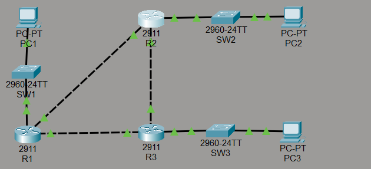

## 1. Verificación de CDP

CDP está activado por defecto en los dispositivos Cisco. Se verifican los vecinos y las interfaces donde está habilitado.

### R3 — Comandos de verificación

```cisco
R3#show cdp
R3#show cdp interface
```


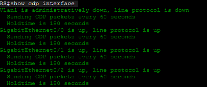

### Vecinos descubiertos con CDP

```cisco
R3#show cdp neighbors
```

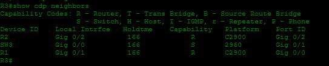

R3 tiene 3 vecinos: dos routers (R1 y R2) y un switch.

```cisco
R3#show cdp neighbors detail
```

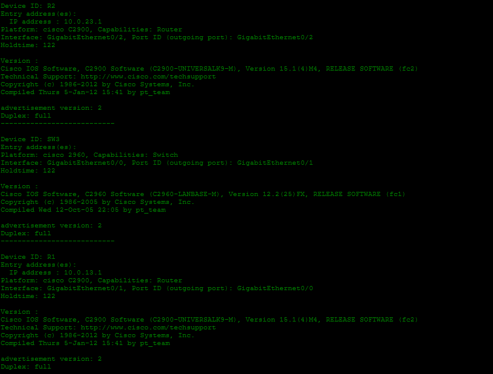

La información detallada muestra las IPs y las interfaces de los vecinos:
- R2 tiene la IP `10.0.23.1` en G0/2
- R1 tiene la IP `10.0.13.1` en G0/0

### Verificación de direcciones IP propias

```cisco
R3#show ip int brief
```

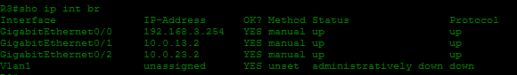

Confirmamos las direcciones IP de R3:
- G0/2: 10.0.23.2 (conectado a R2)
- G0/1: 10.0.13.2 (conectado a R1)

```cisco
R2#show ip int brief
```

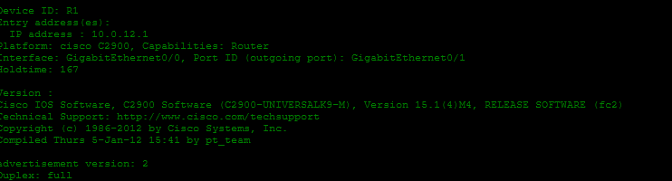

R2 tiene la IP `10.0.12.2` en G0/0, conectado a R1 G0/1 (10.0.12.1).

### Conexiones identificadas

| Enlace                | Interfaz R1 | Interfaz R2 | Interfaz R3 |
| --------------------- | ----------- | ----------- | ----------- |
| R1 — R2               | G0/1 (.12.1) | G0/0 (.12.2) | —           |
| R1 — R3               | G0/0 (.13.1) | —           | G0/1 (.13.2) |
| R2 — R3               | —           | G0/2 (.23.1) | G0/2 (.23.2) |

## 2. Desactivar CDP en interfaces conectadas a PCs

CDP se desactiva en las interfaces de los routers que están conectadas a switches (y por extensión a PCs), ya que no es necesario enviar anuncios CDP hacia dispositivos finales.

```cisco
! R1 — interfaz hacia el switch SW1
R1(config)#int g0/0
R1(config-if)#no cdp enable
```

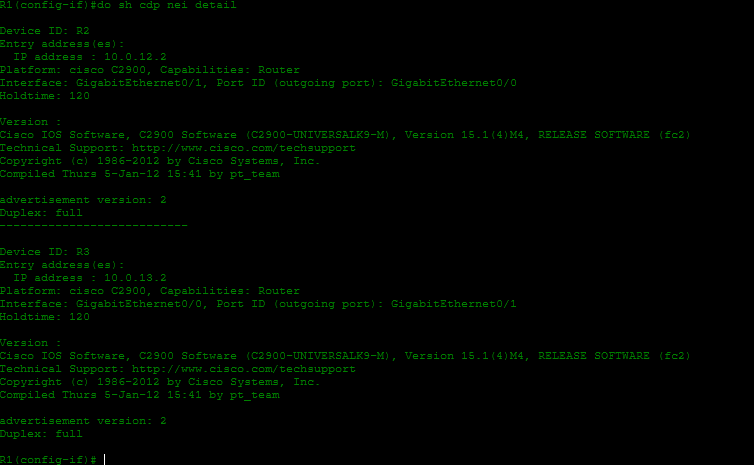

```cisco
! R1 — interfaz hacia otro switch
R1(config)#int g0/2
R1(config-if)#no cdp enable
```

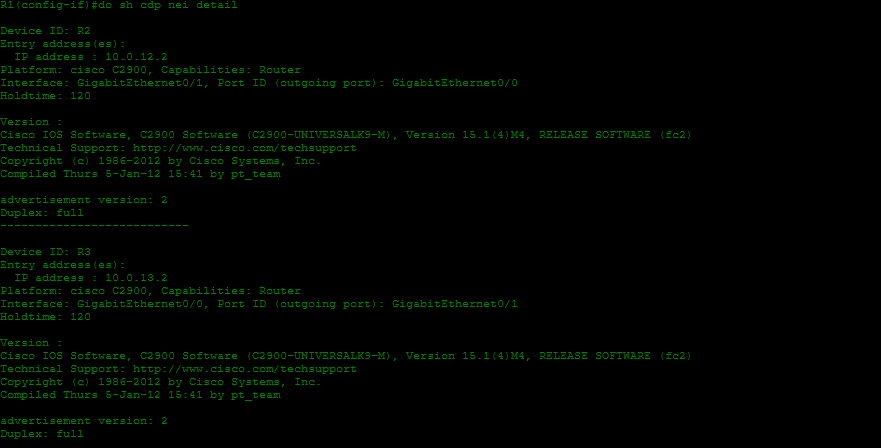

```cisco
! R2 — interfaz hacia el switch SW2
R2(config)#int g0/1
R2(config-if)#no cdp enable
```

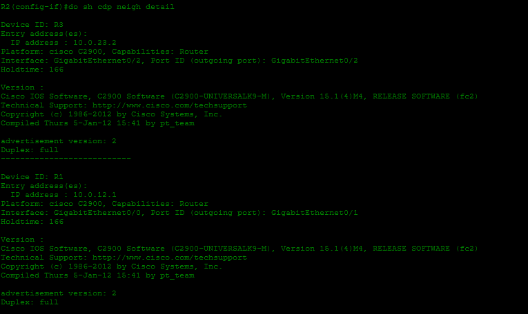

```cisco
! R3 — interfaz hacia el switch SW3
R3(config)#int g0/0
R3(config-if)#no cdp enable
```

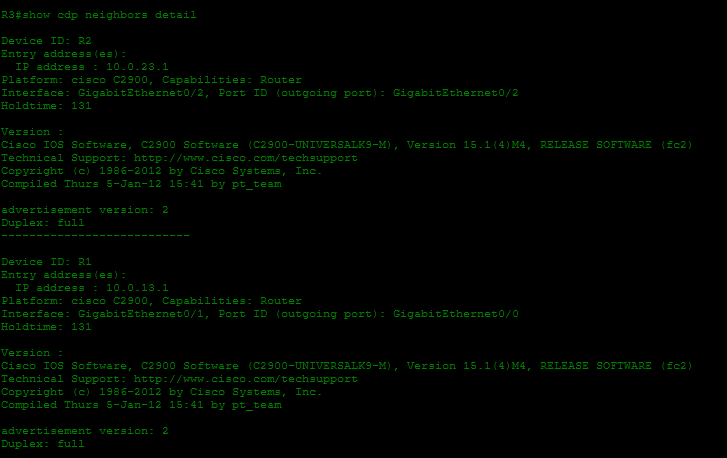

## 3. Desactivar CDP globalmente

Se desactiva CDP en todos los dispositivos de red.

```cisco
R3(config)#no cdp run
```

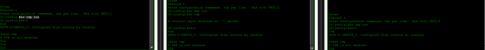

Este comando se aplica también en R1 y R2.

## 4. Activar LLDP

LLDP es un protocolo estándar (IEEE 802.1AB) similar a CDP pero no propietario de Cisco. Se activa globalmente y se habilita la transmisión y recepción en las interfaces entre dispositivos de red.

### Routers

```cisco
! R3
R3(config)#lldp run
R3(config)#int range g0/0-2
R3(config-if-range)#lldp transmit
R3(config-if-range)#lldp receive

! R1
R1(config)#lldp run
R1(config)#int range g0/0-2
R1(config-if-range)#lldp transmit
R1(config-if-range)#lldp receive

! R2
R2(config)#lldp run
R2(config)#int range g0/0-2
R2(config-if-range)#lldp transmit
R2(config-if-range)#lldp receive
```

### Switches

```cisco
! SW1
SW1(config)#no cdp run
SW1(config)#lldp run
SW1(config)#int g0/1
SW1(config-if)#lldp transmit
SW1(config-if)#lldp receive

! SW2
SW2(config)#no cdp run
SW2(config)#lldp run
SW2(config)#int g0/2
SW2(config-if)#lldp transmit
SW2(config-if)#lldp receive

! SW3
SW3(config)#no cdp run
SW3(config)#lldp run
SW3(config)#int g0/1
SW3(config-if)#lldp transmit
SW3(config-if)#lldp receive
```

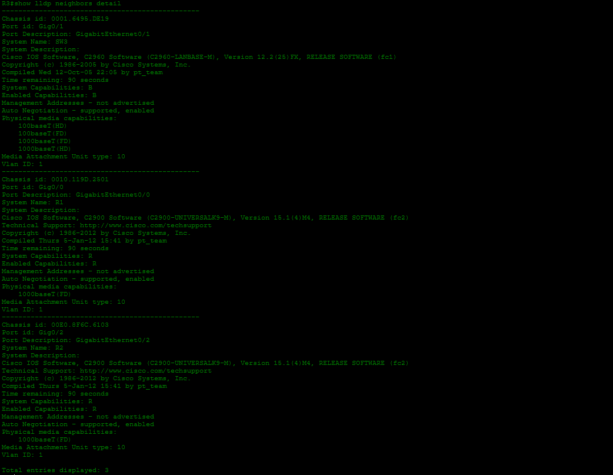

## Topología final

Una vez desactivado CDP y activado LLDP, la topología queda con LLDP como protocolo de descubrimiento.

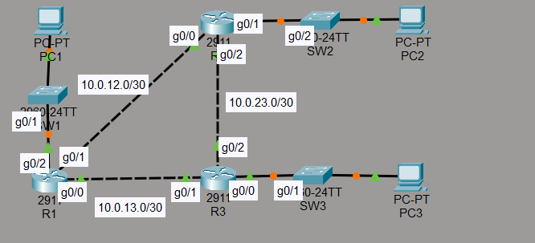

## Resumen de comandos

| Comando                    | Descripción                                   |
| -------------------------- | --------------------------------------------- |
| `show cdp`                 | Verifica el estado global de CDP              |
| `show cdp interface`       | Muestra las interfaces con CDP activo         |
| `show cdp neighbors`       | Muestra los vecinos descubiertos por CDP      |
| `show cdp neighbors detail`| Muestra información detallada de los vecinos  |
| `no cdp enable`            | Desactiva CDP en una interfaz                 |
| `no cdp run`               | Desactiva CDP globalmente                     |
| `lldp run`                 | Activa LLDP globalmente                       |
| `lldp transmit`            | Habilita la transmisión de LLDP en una interfaz |
| `lldp receive`             | Habilita la recepción de LLDP en una interfaz  |
