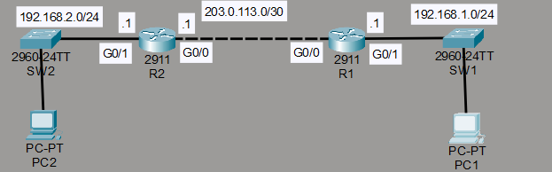
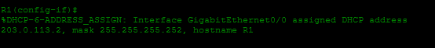
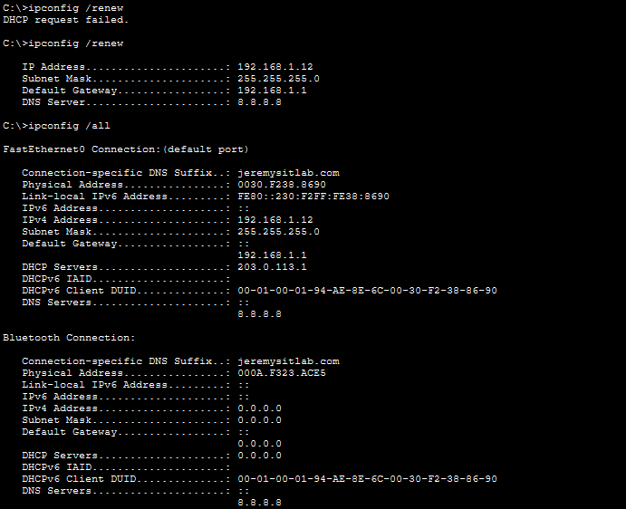

# Laboratorio: DHCP — Day 39 Lab

## Descripción general

En este laboratorio se configura un servidor **DHCP (Dynamic Host Configuration Protocol)** en R2 para asignar direcciones IP automáticamente a los dispositivos de la red. R1 actúa como relay agent para las subredes que no están directamente conectadas a R2.

## Topología



La red consta de:

- **R2**: Servidor DHCP con tres pools de direcciones
- **R1**: Cliente DHCP en el enlace serial y relay agent hacia la LAN 192.168.1.0/24
- **PC1, PC2**: Clientes DHCP en la LAN de R1

## 1. Configurar los pools DHCP en R2

### POOL1 — 192.168.1.0/24 (LAN de R1)

Se reservan las primeras 10 direcciones (.1 a .10) para asignaciones estáticas.

```cisco
R2(config)#ip dhcp excluded-address 192.168.1.1 192.168.1.10
R2(config)#ip dhcp pool POOL1
R2(dhcp-config)#network 192.168.1.0 255.255.255.0
R2(dhcp-config)#dns-server 8.8.8.8
R2(dhcp-config)#domain-name jeremysitlab.com
R2(dhcp-config)#default-router 192.168.1.1
```

### POOL2 — 192.168.2.0/24 (LAN de R2)

```cisco
R2(config)#ip dhcp excluded-address 192.168.2.1 192.168.2.10
R2(config)#ip dhcp pool POOL2
R2(dhcp-config)#network 192.168.2.0 255.255.255.0
R2(dhcp-config)#dns-server 8.8.8.8
R2(dhcp-config)#domain-name jeremysitlab.com
R2(dhcp-config)#default-router 192.168.2.1
```

### POOL3 — 203.0.113.0/30 (Enlace serial)

Se reserva la dirección .1 (R2).

```cisco
R2(config)#ip dhcp excluded-address 203.0.113.1
R2(config)#ip dhcp pool POOL3
R2(dhcp-config)#network 203.0.113.0 255.255.255.252
```

## 2. Configurar R1 como cliente DHCP

La interfaz G0/0 de R1 obtiene una dirección IP automáticamente del pool POOL3.

```cisco
R1(config)#int g0/0
R1(config-if)#ip address dhcp
R1(config-if)#no shutdown
```



## 3. Configurar R1 como relay DHCP

La interfaz G0/1 (conectada a la LAN 192.168.1.0/24) se configura para reenviar las solicitudes DHCP hacia el servidor en R2.

```cisco
R1(config-if)#int g0/1
R1(config-if)#ip helper-address 203.0.113.1
```

## 4. Solicitar dirección IP desde las PCs

Las PCs en la LAN 192.168.1.0/24 solicitan una dirección IP al servidor DHCP a través del relay agent.




## Resumen de la configuración

| Dispositivo | Rol             | Pool          | Red              | Gateway        |
| ----------- | --------------- | ------------- | ---------------- | -------------- |
| R2          | Servidor DHCP   | POOL1         | 192.168.1.0/24   | 192.168.1.1    |
| R2          | Servidor DHCP   | POOL2         | 192.168.2.0/24   | 192.168.2.1    |
| R2          | Servidor DHCP   | POOL3         | 203.0.113.0/30   | —              |
| R1 G0/0     | Cliente DHCP    | POOL3         | 203.0.113.0/30   | —              |
| R1 G0/1     | Relay agent     | —             | —                | —              |
| PC1, PC2    | Clientes DHCP   | POOL1         | 192.168.1.0/24   | 192.168.1.1    |

## Resumen de comandos

| Comando                                        | Descripción                                      |
| ---------------------------------------------- | ------------------------------------------------ |
| `ip dhcp excluded-address <inicio> <fin>`      | Reserva un rango de direcciones (no se asignan)  |
| `ip dhcp pool <nombre>`                        | Crea un pool DHCP                                |
| `network <red> <máscara>`                      | Define la red del pool                           |
| `dns-server <ip>`                              | Define el servidor DNS para los clientes         |
| `domain-name <dominio>`                        | Define el nombre de dominio                      |
| `default-router <ip>`                          | Define el gateway por defecto                    |
| `ip address dhcp`                              | Configura la interfaz como cliente DHCP          |
| `ip helper-address <ip>`                       | Configura relay agent para reenviar solicitudes DHCP |
