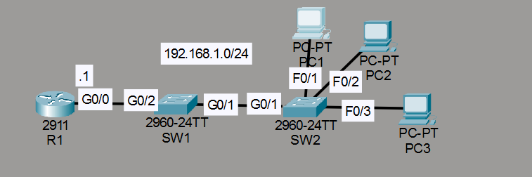
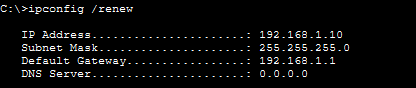

# Laboratorio: DHCP Snooping — Day 50 Lab

## Descripción general

En este laboratorio se configura **DHCP Snooping** en los switches para proteger la red contra servidores DHCP no autorizados. Se define R1 como servidor DHCP legítimo y se marcan los puertos de uplink como confiables.

## Topología



## 1. Configurar R1 como servidor DHCP

Se reservan las direcciones .1 a .9 para asignaciones fijas y se configura el gateway.

```cisco
R1(config)#ip dhcp excluded-address 192.168.1.1 192.168.1.9
R1(config)#ip dhcp pool POOL1
R1(dhcp-config)#network 192.168.1.0 255.255.255.0
R1(dhcp-config)#default-router 192.168.1.1
```

## 2. Configurar DHCP Snooping en SW1 y SW2

Se activa DHCP Snooping globalmente y en la VLAN 1. Se desactiva la opción 82 (information option) para evitar problemas de compatibilidad. Los puertos de uplink se configuran como **trusted** para permitir el tráfico DHCP desde el servidor legítimo.

```cisco
! SW2
SW2(config)#ip dhcp snooping
SW2(config)#ip dhcp snooping vlan 1
SW2(config)#no ip dhcp snooping information option
SW2(config)#int g0/1
SW2(config-if)#ip dhcp snooping trust
!
! SW1
SW1(config)#ip dhcp snooping
SW1(config)#ip dhcp snooping vlan 1
SW1(config)#no ip dhcp snooping information option
SW1(config)#int g0/2
SW1(config-if)#ip dhcp snooping trust
```

## 3. Solicitar IP por DHCP

En PC1 se ejecuta `ipconfig /renew` para obtener una dirección IP del servidor DHCP.



Viendo el lab de Jeremy he visto que les da un problema de primeras, pero eso era porque no había configurado los switches con `no ip dhcp snooping information option`.

## Resumen de comandos

| Comando                                   | Descripción                                             |
| ----------------------------------------- | ------------------------------------------------------- |
| `ip dhcp snooping`                        | Activa DHCP Snooping globalmente                        |
| `ip dhcp snooping vlan <id>`              | Activa DHCP Snooping en una VLAN específica             |
| `no ip dhcp snooping information option`   | Desactiva la opción 82 de DHCP Snooping                 |
| `ip dhcp snooping trust`                  | Marca una interfaz como confiable (trusted)             |
| `show ip dhcp snooping`                   | Muestra el estado de DHCP Snooping                      |
