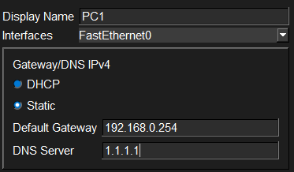
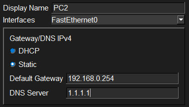
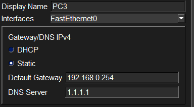
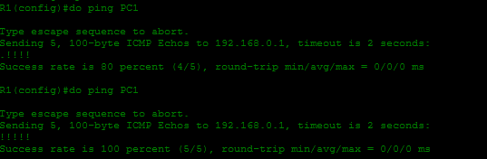
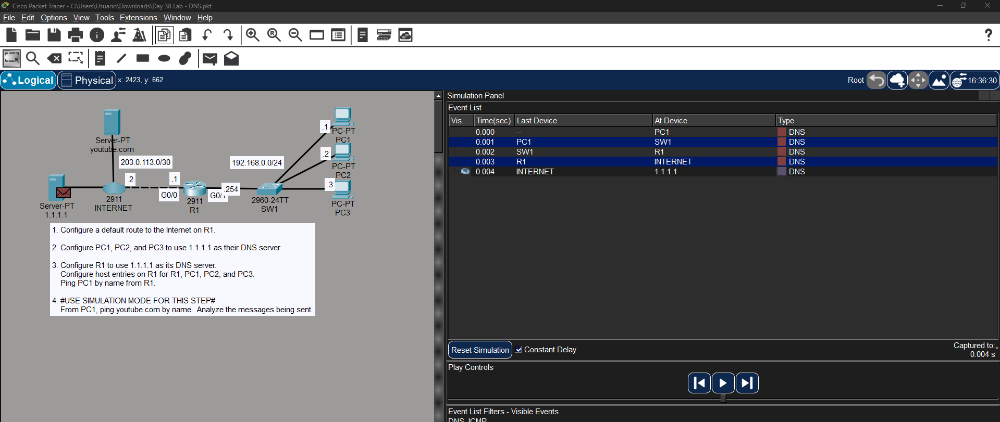
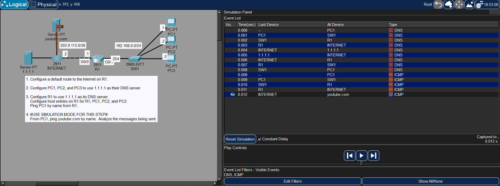

# Laboratorio: DNS — Day 38 Lab

## Descripción general

En este laboratorio se configura **DNS (Domain Name System)** en una red. Se asignan servidores DNS a las PCs, se configuran host entries en el router y se analiza el proceso de resolución de nombres cuando una PC hace ping a un dominio de Internet.

## Topología

La red consta de un router R1 conectado a Internet y a una LAN con tres PCs. R1 tiene una ruta por defecto hacia `203.0.113.2`.

## 1. Ruta por defecto en R1

```cisco
R1(config)#ip route 0.0.0.0 0.0.0.0 203.0.113.2
```

## 2. Configurar DNS en las PCs

Se configura `1.1.1.1` como servidor DNS en cada PC.

### PC1



### PC2



### PC3



## 3. Configurar DNS en R1

Se configura R1 para usar el mismo servidor DNS y se crean host entries para los dispositivos de la red local.

```cisco
R1(config)#ip name-server 1.1.1.1
R1(config)#ip domain lookup
!
R1(config)#ip host PC1 192.168.0.1
R1(config)#ip host PC2 192.168.0.2
R1(config)#ip host PC3 192.168.0.3
```

### Verificación

Se hace ping desde R1 a PC1 usando su nombre. La resolución funciona correctamente.



## 4. Resolución de nombres desde una PC (modo simulación)

Desde PC1 se hace ping a `youtube.com`. En modo simulación se pueden observar los mensajes intercambiados.

### Consulta DNS

PC1 envía una consulta DNS al servidor `1.1.1.1` para resolver la dirección IP de `youtube.com`.



### Respuesta DNS

El servidor DNS responde con la dirección IP de `youtube.com`. Una vez que PC1 conoce la IP, puede enviar el mensaje ICMP al servidor de YouTube.



## Resumen de comandos

| Comando                                      | Descripción                                    |
| -------------------------------------------- | ---------------------------------------------- |
| `ip name-server <ip>`                        | Configura la dirección del servidor DNS         |
| `ip domain lookup`                           | Activa la resolución de nombres DNS en el router |
| `ip host <nombre> <ip>`                      | Crea una entrada estática de hostname           |
