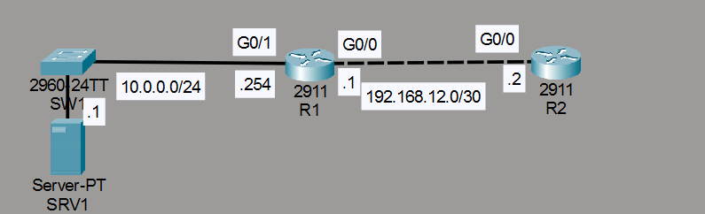
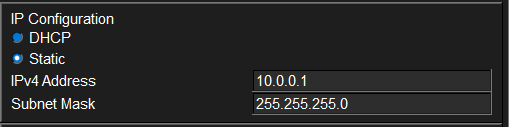
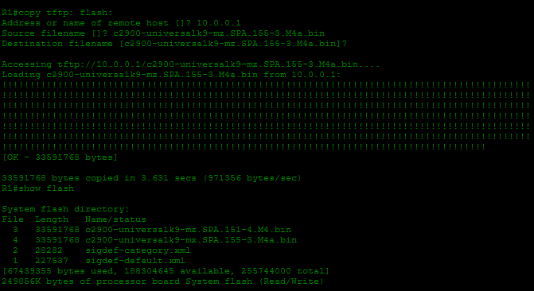
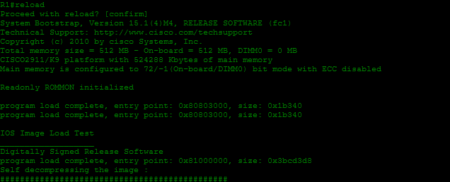
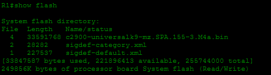
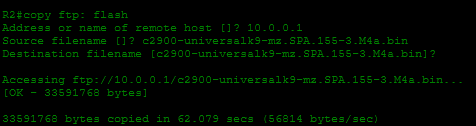
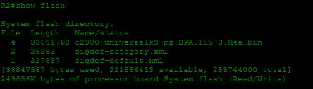

# Laboratorio: FTP & TFTP — Day 43 Lab

## Descripción general

En este laboratorio se transfieren archivos de sistema operativo desde un servidor a los routers usando **TFTP** y **FTP**. Luego se actualiza el IOS de los routers y se eliminan los archivos antiguos de la memoria flash.

## Topología



La red consta de dos routers (R1, R2), un servidor (SRV1) con servicios FTP y TFTP, y dos PCs. La conectividad se establece mediante OSPF.

## Configuración inicial de direcciones IP

### R1

```cisco
R1(config)#int g0/0
R1(config-if)#ip address 192.168.12.1 255.255.255.252
R1(config-if)#no shutdown
!
R1(config-if)#int g0/1
R1(config-if)#ip address 10.0.0.254 255.255.255.0
R1(config-if)#no shutdown
```

### R2

```cisco
R2(config)#int g0/0
R2(config-if)#ip address 192.168.12.2 255.255.255.252
R2(config-if)#no shutdown
```

### Servidor SRV1



## Configuración de OSPF

### R1

```cisco
R1(config)#router ospf 1
R1(config-router)#network 192.168.12.0 0.0.0.3 area 1
R1(config-router)#network 10.0.0.0 0.0.0.255 area 1
R1(config-router)#passive-interface g0/1
```

### R2

```cisco
R2(config)#router ospf 2
R2(config-router)#network 192.168.12.0 0.0.0.3 area 1
```

## Transferencia de archivos por TFTP (R1)

Se descarga el archivo `c2900-universalk9-mz.SPA.155-3.M4a.bin` desde SRV1 mediante TFTP.

```cisco
R1#copy tftp: flash:
```



### Actualizar el IOS de R1

Se configura el router para que cargue la nueva imagen al iniciar.

```cisco
R1(config)#boot system flash:c2900-universalk9-mz.SPA.155-3.M4a.bin
R1#write
R1#reload
```



### Eliminar el IOS antiguo

```cisco
R1#delete flash:c2900-universalk9-mz.SPA.151-4.M4.bin
```



## Transferencia de archivos por FTP (R2)

Se configura FTP con credenciales y se descarga la misma imagen.

```cisco
R2(config)#ip ftp username jeremy
R2(config)#ip ftp password ccna
!
R2#copy ftp: flash:
```



### Actualizar el IOS de R2

```cisco
R2(config)#boot system flash:c2900-universalk9-mz.SPA.155-3.M4a.bin
R2#write
R2#reload
!
R2#delete flash:c2900-universalk9-mz.SPA.151-4.M4.bin
```



## Comparativa TFTP vs FTP

| Característica     | TFTP                          | FTP                             |
| ------------------ | ----------------------------- | ------------------------------- |
| Puerto             | UDP 69                        | TCP 20 (datos) y 21 (control)   |
| Autenticación      | No requiere                   | Requiere usuario y contraseña   |
| Confiabilidad      | Baja (sin confirmación)       | Alta (orientado a conexión)     |
| Velocidad          | Más rápido en redes locales   | Más lento por la sobrecarga TCP |

## Resumen de comandos

| Comando                                              | Descripción                                          |
| ---------------------------------------------------- | ---------------------------------------------------- |
| `copy tftp: flash:`                                  | Copia un archivo desde un servidor TFTP a flash      |
| `copy ftp: flash:`                                   | Copia un archivo desde un servidor FTP a flash       |
| `ip ftp username <user>`                             | Configura el usuario FTP                             |
| `ip ftp password <pw>`                               | Configura la contraseña FTP                          |
| `boot system flash:<archivo>`                        | Configura el IOS que se cargará al iniciar           |
| `reload`                                             | Reinicia el router                                   |
| `delete flash:<archivo>`                             | Elimina un archivo de la memoria flash               |
