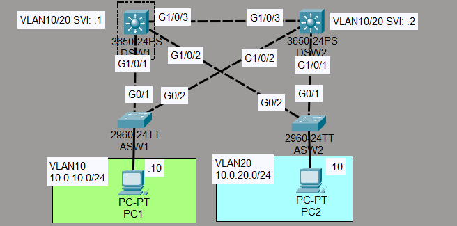
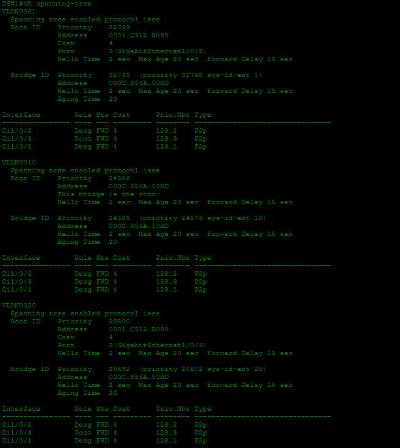
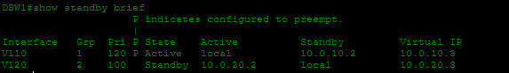
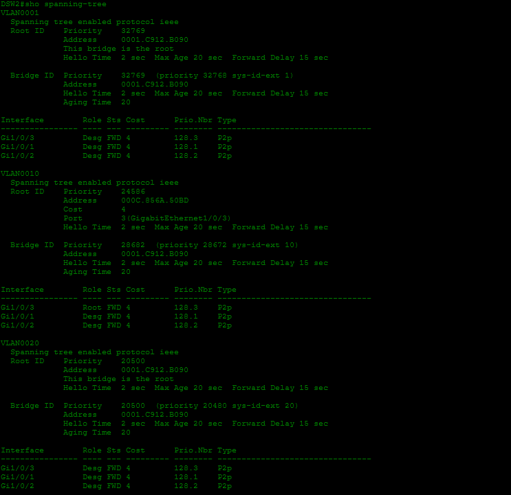
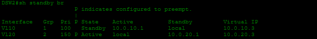

# Laboratorio: Sincronización STP y HSRP — Day 52 Lab

## Descripción general

En este laboratorio se configura HSRP en los switches multicapa DSW1 y DSW2. También se sincroniza el diseño de HSRP con STP para que el switch que actúa como gateway activo sea también el root bridge de cada VLAN.

## Topología



## Objetivos

- En la VLAN 10, DSW1 será HSRP active y STP root.
- En la VLAN 10, DSW2 será HSRP standby y STP secondary root.
- En la VLAN 20, DSW2 será HSRP active y STP root.
- En la VLAN 20, DSW1 será HSRP standby y STP secondary root.

Esta distribución permite repartir el tráfico entre los dos switches y evita que el tráfico tenga que cruzar innecesariamente entre ellos.

## VLAN 10

### DSW1: HSRP active y STP root

DSW1 utiliza una prioridad HSRP de 120 y `preempt` para recuperar el estado active cuando vuelva a estar disponible.

```cisco
DSW1(config)#int vlan 10
DSW1(config-if)#standby 1 ip 10.0.10.3
DSW1(config-if)#standby 1 priority 120
DSW1(config-if)#standby 1 preempt
DSW1(config-if)#standby version 2
!
DSW1(config)#spanning-tree vlan 10 root primary
```

### DSW2: HSRP standby y STP secondary root

```cisco
DSW2(config)#int vlan 10
DSW2(config-if)#standby 1 ip 10.0.10.3
DSW2(config-if)#standby version 2
!
DSW2(config)#spanning-tree vlan 10 root secondary
```

## VLAN 20

### DSW2: HSRP active y STP root

DSW2 utiliza una prioridad HSRP de 150, superior a la de DSW1, y se configura como root primary de la VLAN 20.

```cisco
DSW2(config)#int vlan 20
DSW2(config-if)#standby 2 ip 10.0.20.3
DSW2(config-if)#standby 2 priority 150
DSW2(config-if)#standby 2 preempt
DSW2(config-if)#standby version 2
!
DSW2(config)#spanning-tree vlan 20 root primary
```

### DSW1: HSRP standby y STP secondary root

```cisco
DSW1(config)#int vlan 20
DSW1(config-if)#standby 2 ip 10.0.20.3
DSW1(config-if)#standby version 2
!
DSW1(config)#spanning-tree vlan 20 root secondary
```

## Capturas de la configuración
Switch 1 




Switch 2




## Conceptos principales

- **HSRP active:** switch que responde por la dirección IP virtual y funciona como gateway principal.
- **HSRP standby:** switch que mantiene la redundancia y puede asumir el servicio si falla el active.
- **STP root bridge:** switch que sirve como referencia para calcular los caminos de la VLAN.
- **`preempt`:** permite que un switch con mayor prioridad recupere el rol active después de volver a estar operativo.