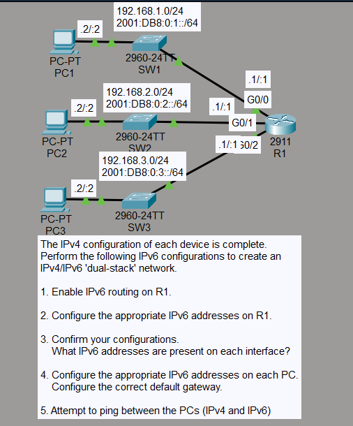
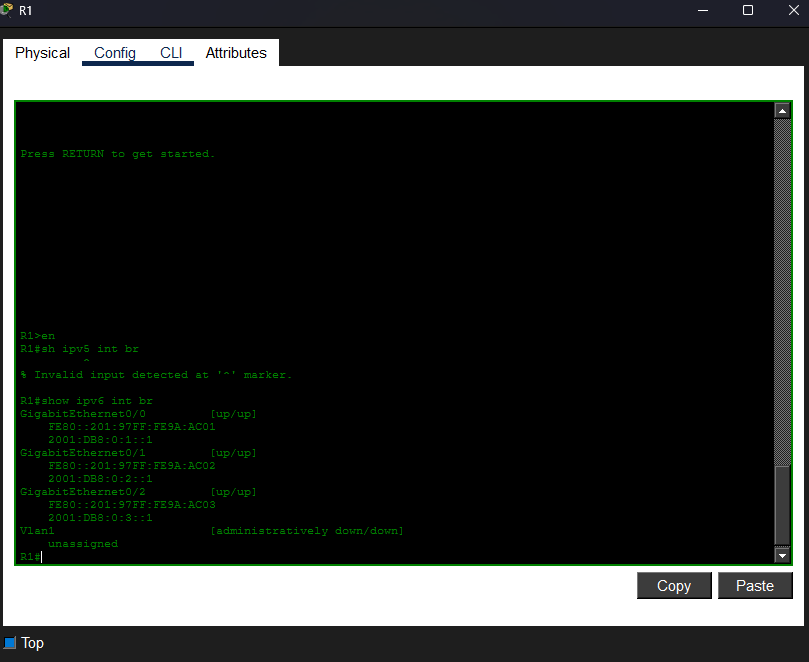
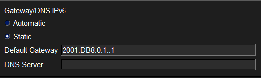
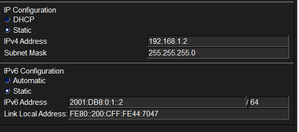
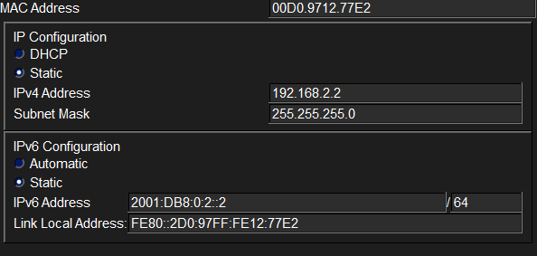
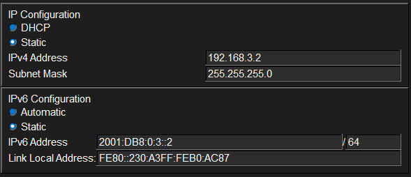
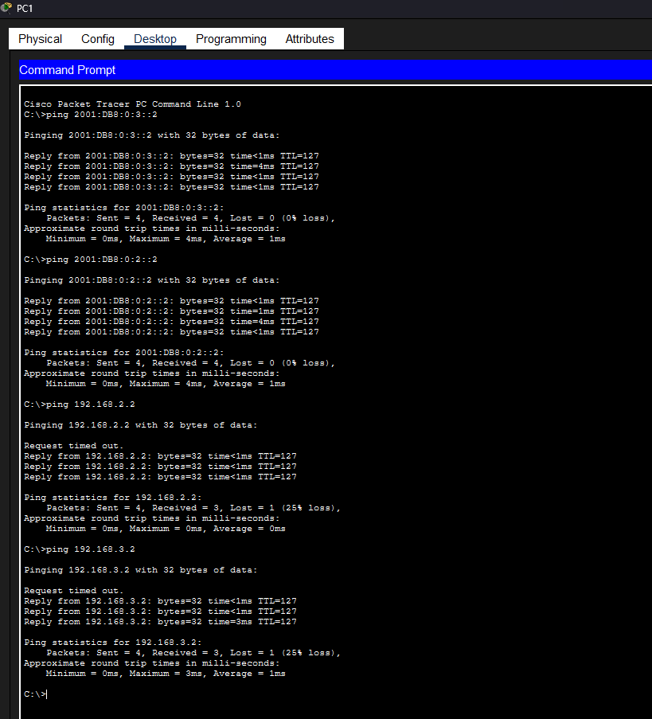

# Laboratorio: Configuring IPv6 (Part 1) — Day 31 Lab CCNA 200-301

## Descripción

Configuración de IPV6.

## Topología



La red consta de un router R1 conectado a tres PCs a través de switches. Cada PC pertenece a una subred IPv6 diferente.

## Direccionamiento IPv6

| Dispositivo | Interfaz | Dirección IPv6          | Prefijo |
| ----------- | -------- | ----------------------- | ------- |
| R1          | g0/0     | 2001:DB8:0:1::1        | /64     |
| R1          | g0/1     | 2001:DB8:0:2::1        | /64     |
| R1          | g0/2     | 2001:DB8:0:3::1        | /64     |
| PC1         | NIC      | 2001:DB8:0:1::2        | /64     |
| PC2         | NIC      | 2001:DB8:0:2::2        | /64     |
| PC3         | NIC      | 2001:DB8:0:3::2        | /64     |

## Configuración de R1

Para que un router pueda reenviar tráfico IPv6, primero se debe habilitar el enrutamiento IPv6 global con el comando `ipv6 unicast-routing`.

```cisco
R1(config)#ipv6 unicast-routing
!
R1(config)#int g0/0
R1(config-if)#ipv6 address 2001:DB8:0:1::1/64
R1(config-if)#no shutdown
!
R1(config-if)#int g0/1
R1(config-if)#ipv6 address 2001:DB8:0:2::1/64
R1(config-if)#no shutdown
!
R1(config-if)#int g0/2
R1(config-if)#ipv6 address 2001:DB8:0:3::1/64
R1(config-if)#no shutdown
```



## Configuración de las PCs

Cada PC recibe una dirección IPv6 estática y su respectivo gateway (la dirección IPv6 de la interfaz del router en esa subred).

### PC1

Gateway: `2001:DB8:0:1::1`




### PC2

Gateway: `2001:DB8:0:2::1`



### PC3

Gateway: `2001:DB8:0:3::1`



## Verificación de conectividad

Para comprobar que la configuración funciona correctamente, se realiza un ping desde PC1 hacia las demás PCs.



PC1 debe poder alcanzar tanto a PC2 como a PC3. Si el ping es exitoso, el enrutamiento IPv6 está funcionando correctamente.

## Resumen de comandos utilizados

| Comando                          | Descripción                                        |
| -------------------------------- | -------------------------------------------------- |
| `ipv6 unicast-routing`           | Habilita el reenvío de paquetes IPv6 en el router  |
| `ipv6 address <dir>/<prefijo>`   | Asigna una dirección IPv6 a una interfaz           |