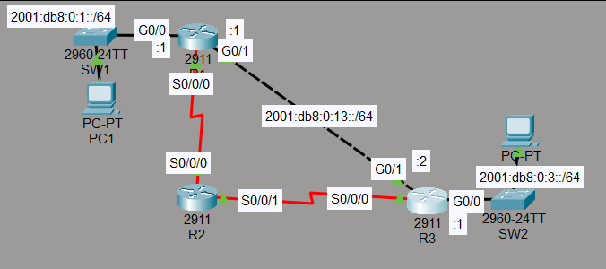
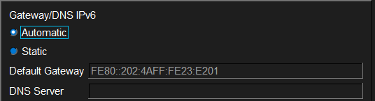
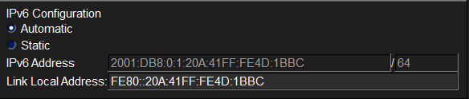
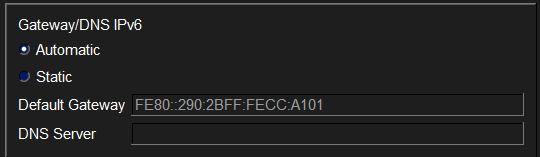
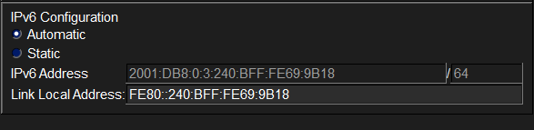
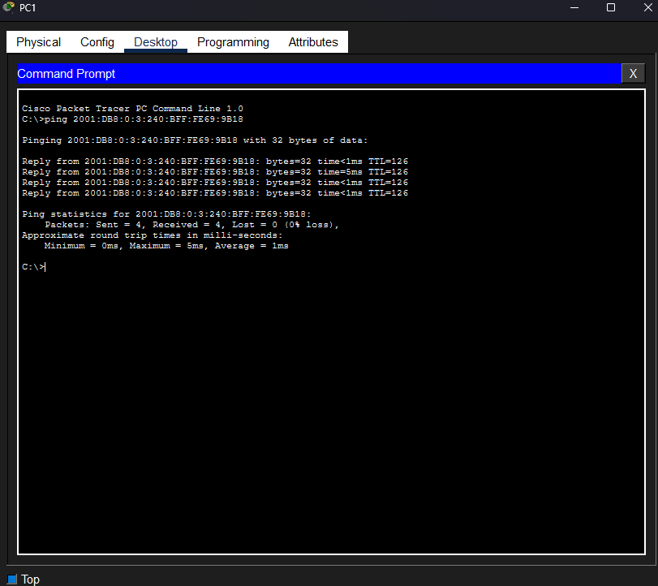

# Laboratorio: IPv6 Static Routes — Day 33 Lab

## Descripción general

En este laboratorio se habilitan rutas estáticas IPv6 en una red con tres routers. Se configura una ruta principal que pasa por R2 y una ruta de respaldo con distancia administrativa mayor a través de un enlace serial directo entre R1 y R3. Las PCs obtienen su dirección IPv6 mediante SLAAC.

## Topología



La red consta de tres routers:

- **R1**: Conectado a PC1 (subred `2001:db8:0:1::/64`) y a R2 mediante un enlace serial
- **R3**: Conectado a PC2 (subred `2001:db8:0:3::/64`) y a R2 mediante un enlace serial
- **R2**: Router intermediario que conecta con R1 y R3 por serial, también conectado por GigabitEthernet a R1 y R3
- **R1 — R3**: Enlace serial directo como ruta de respaldo

## Direccionamiento IPv6

Las direcciones IPv6 ya están preconfiguradas en los routers. Los enlaces seriales solo utilizan direcciones link-local.

## Habilitar enrutamiento IPv6

```cisco
R1(config)#ipv6 unicast-routing
R2(config)#ipv6 unicast-routing
R3(config)#ipv6 unicast-routing
```

## Configuración de las PCs (SLAAC)

Las PCs obtienen su dirección IPv6 automáticamente mediante SLAAC (Stateless Address Autoconfiguration) a partir de los anuncios de los routers.

### PC1




### PC2




## Rutas estáticas IPv6

### Rutas principales (a través de R2)

Estas rutas tienen la distancia administrativa por defecto (AD 1) y son la ruta principal hacia la red del otro lado.

```cisco
! R1 — ruta hacia la red de PC2 vía R2
R1(config)#ipv6 route 2001:db8:0:3::/64 g0/1 FE80::290:2BFF:FECC:A102

! R3 — ruta hacia la red de PC1 vía R2
R3(config)#ipv6 route 2001:db8:0:1::/64 g0/1 FE80::202:4AFF:FE23:E202

! R2 — rutas hacia ambas redes
R2(config)#ipv6 route 2001:db8:0:1::/64 s0/0/0 FE80::202:4AFF:FE23:E201
R2(config)#ipv6 route 2001:db8:0:3::/64 s0/0/1 FE80::290:2BFF:FECC:A101
```

### Rutas de respaldo (a través del enlace serial directo)

Estas rutas tienen una distancia administrativa de 10, por lo que solo se usan si la ruta principal por R2 falla.

```cisco
! R1 — ruta de respaldo hacia la red de PC3 vía el serial directo a R3
R1(config)#ipv6 route 2001:db8:0:3::/64 s0/0/0 FE80::20B:BEFF:FED7:4901 10

! R3 — ruta de respaldo hacia la red de PC1 vía el serial directo a R1
R3(config)#ipv6 route 2001:db8:0:1::/64 s0/0/0 FE80::20B:BEFF:FED7:4901 10
```

## Pruebas de conectividad

Se realizan pruebas de ping entre PC1 y PC2 para verificar que las rutas estáticas funcionan correctamente.



## Resumen de comandos

| Comando                                                           | Descripción                                      |
| ----------------------------------------------------------------- | ------------------------------------------------ |
| `ipv6 unicast-routing`                                            | Habilita el reenvío de paquetes IPv6             |
| `ipv6 route <destino>/<prefijo> <interfaz> <next-hop>`            | Configura una ruta estática IPv6                 |
| `ipv6 route <destino>/<prefijo> <interfaz> <next-hop> <AD>`       | Ruta estática con distancia administrativa personalizada |
