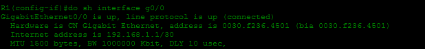
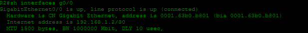
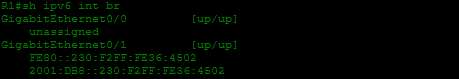
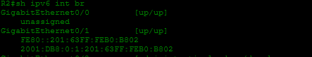
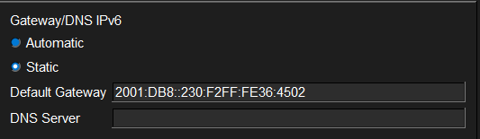
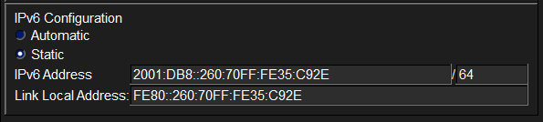
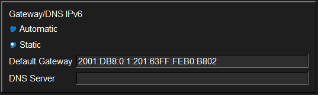
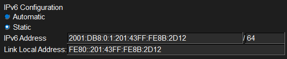
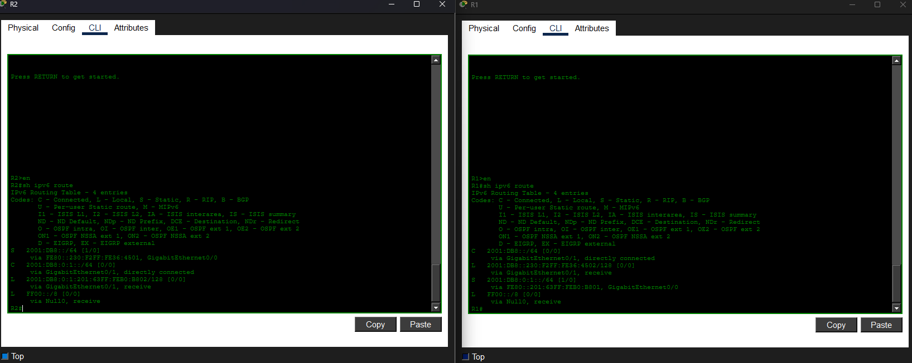
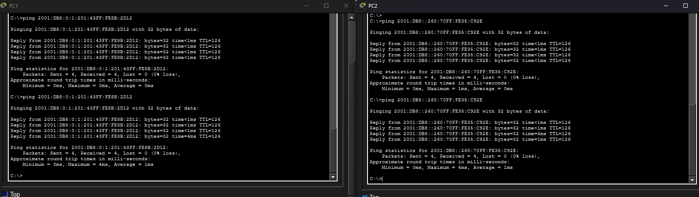

# Laboratorio: IPv6 Configuration (Part 2) — Day 32 Lab

## Descripción general

En este laboratorio se configura IPv6 utilizando direcciones generadas con **EUI-64**, se habilita IPv6 en interfaces sin asignar una dirección global, y se configuran rutas estáticas IPv6 para permitir la comunicación entre dos PCs en diferentes subredes.

## Topología

La red consta de dos routers (R1 y R2) conectados mediante sus interfaces G0/0. Cada router tiene una LAN propia:

- **R1 G0/1**: Subred `2001:db8::/64` — conecta a PC1
- **R2 G0/1**: Subred `2001:db8:0:1::/64` — conecta a PC2
- **R1 G0/0 — R2 G0/0**: Enlace punto a punto (solo direcciones link-local)

## Cálculo de EUI-64

EUI-64 genera un identificador de interfaz de 64 bits a partir de la dirección MAC. El proceso es el siguiente:

1. Dividir la MAC en dos mitades.
2. Insertar `FFFE` en el medio.
3. Invertir el séptimo bit (U/L bit) del primer byte.

### R1 — G0/1

MAC de la interfaz: `0030.F236.4501`



Dirección generada: `2001:DB8::230:F2FF:FE36:4501/64`

### R2 — G0/1

MAC de la interfaz: `0001.63B0.B801`



Dirección generada: `2001:DB8:0:1:201:63FF:FEB0:B801/64`

## Configuración de los routers

### R1

```cisco
R1(config)#ipv6 unicast-routing
R1(config-if)#ipv6 address 2001:db8::/64 eui-64
R1(config-if)#no shutdown
```



### R2

```cisco
R2(config)#ipv6 unicast-routing
R2(config-if)#ipv6 address 2001:db8:0:1::/64 eui-64
R2(config-if)#no shutdown
```



### Interfaces del enlace punto a punto (G0/0)

Solo se habilita IPv6 con `ipv6 enable`, sin asignar una dirección global. La interfaz obtendrá automáticamente una dirección link-local (FE80::).

```cisco
R1(config)#int g0/0
R1(config-if)#ipv6 enable
!
R2(config)#int g0/0
R2(config-if)#ipv6 enable
```

## Configuración de las PCs

Las PCs también utilizan EUI-64 para generar su dirección IPv6 dentro de la subred correspondiente.

### PC1

Subred: `2001:db8::/64`




### PC2

Subred: `2001:db8:0:1::/64`




## Rutas estáticas IPv6

Para que PC1 y PC2 puedan comunicarse, cada router necesita una ruta hacia la red del otro lado. Se utiliza la dirección **link-local** del router vecino como next-hop.

### R1 — Ruta hacia la red de PC2

```cisco
R1(config)#ipv6 route 2001:db8:0:1::/64 g0/0 FE80::201:63FF:FEB0:B801
```

### R2 — Ruta hacia la red de PC1

```cisco
R2(config)#ipv6 route 2001:db8::/64 g0/0 FE80::230:F2FF:FE36:4501
```



## Pruebas de conectividad

Desde PC1 se realiza un ping a PC2 para verificar que las rutas estáticas funcionan correctamente.



## Resumen de comandos

| Comando                                      | Descripción                                            |
| -------------------------------------------- | ------------------------------------------------------ |
| `ipv6 unicast-routing`                       | Habilita el reenvío de paquetes IPv6 en el router      |
| `ipv6 address <prefijo>::/64 eui-64`         | Asigna dirección IPv6 usando EUI-64                    |
| `ipv6 enable`                                | Habilita IPv6 en una interfaz (solo link-local)        |
| `ipv6 route <destino>/64 <interfaz> <next-hop>` | Configura una ruta estática IPv6                    |
