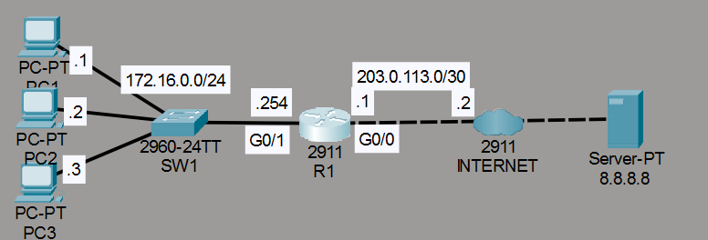
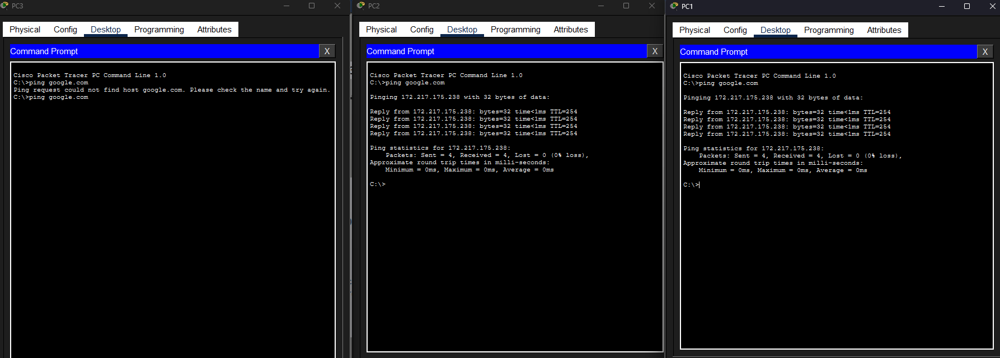
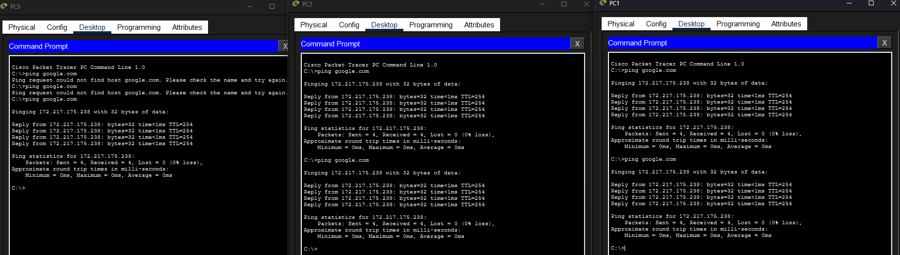
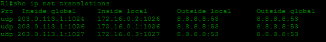

# Laboratorio: Dynamic NAT — Day 45 Lab

## Descripción general

En este laboratorio se configura **NAT dinámico** y luego **PAT (Port Address Translation)** en R1 para que las PCs de la red interna puedan acceder a Internet compartiendo direcciones IP públicas.

## Topología



## 1. Configurar Dynamic NAT

Se definen las interfaces inside/outside, se crea una ACL para la red interna y un pool de direcciones públicas.

```cisco
R1(config)#int g0/1
R1(config-if)#ip nat inside
!
R1(config-if)#int g0/0
R1(config-if)#ip nat outside
!
R1(config)#access-list 1 permit 172.16.0.0 0.0.0.255
!
R1(config)#ip nat pool POOL1 100.0.0.1 100.0.0.2 netmask 255.255.255.0
R1(config)#ip nat inside source list 1 pool POOL1
```

## 2. Prueba con Dynamic NAT

PC1 y PC2 hacen ping a `google.com` y funciona. Ambas reciben una IP del pool.



PC3 intenta hacer ping pero **falla**. El pool solo tiene 2 direcciones (100.0.0.1 y 100.0.0.2), y ambas ya están ocupadas por PC1 y PC2.


## 3. Cambiar a PAT (NAT Overload)

Se elimina la configuración de Dynamic NAT y se configura PAT usando la IP pública de la interfaz G0/0 de R1.

```cisco
R1(config)#no ip nat inside source list 1 pool POOL1
R1#clear ip nat translation *
!
R1(config)#ip nat inside source list 1 interface g0/0 overload
```

## 4. Prueba con PAT

Ahora todas las PCs pueden hacer ping a `google.com`. PAT permite que múltiples dispositivos compartan una misma IP pública diferenciando las conexiones por puerto.



### Traducciones NAT con PAT

```cisco
R1#show ip nat translations
```



Todas las PCs utilizan la misma IP pública (100.0.0.1), pero con números de puerto distintos para cada conexión.

## Resumen de comandos

| Comando                                                         | Descripción                                           |
| --------------------------------------------------------------- | ----------------------------------------------------- |
| `ip nat inside`                                                 | Marca una interfaz como inside                        |
| `ip nat outside`                                                | Marca una interfaz como outside                       |
| `ip nat pool <nombre> <inicio> <fin> netmask <máscara>`        | Crea un pool de direcciones públicas                  |
| `ip nat inside source list <acl> pool <pool>`                  | Configura Dynamic NAT                                 |
| `ip nat inside source list <acl> interface <int> overload`     | Configura PAT usando la IP de una interfaz            |
| `clear ip nat translation *`                                    | Elimina todas las traducciones NAT dinámicas          |
| `show ip nat translations`                                      | Muestra las traducciones NAT activas                  |
