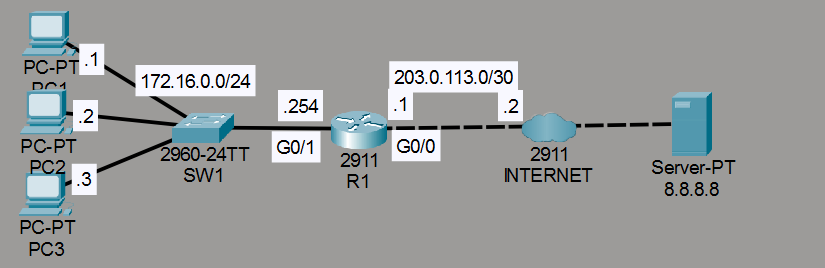
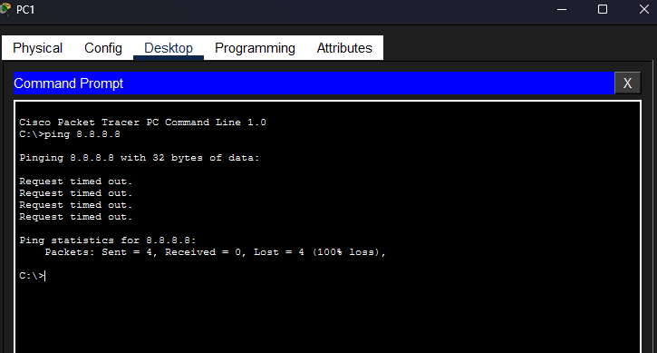
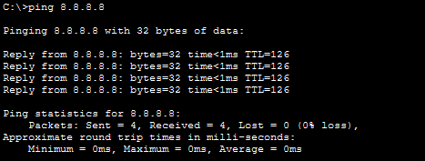
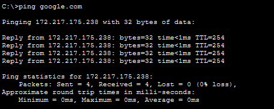
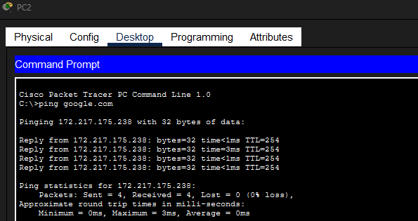
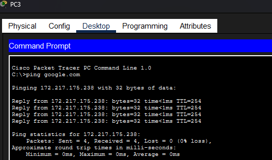
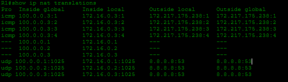
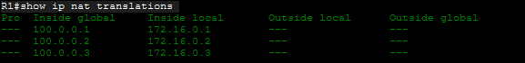

# Laboratorio: Static NAT — Day 44 Lab

## Descripción general

En este laboratorio se configura **NAT estático (Static NAT)** en R1 para que las PCs de la red interna puedan comunicarse con Internet usando direcciones IP públicas.

## Topología



La red consta de R1 con una interfaz inside (G0/1, red 172.16.0.0/24) y una interfaz outside (G0/0, conectada a Internet). Tres PCs (PC1, PC2, PC3) están en la LAN interna.

## 1. Verificación inicial

Antes de configurar NAT, se hace ping a `8.8.8.8` desde PC1. El ping falla porque las direcciones privadas no son enrutables en Internet.



## 2. Configurar Static NAT en R1

Se definen las interfaces inside y outside, y se mapean las IPs privadas de las PCs a direcciones públicas en el rango `100.0.0.0/24`.

```cisco
R1(config)#int g0/1
R1(config-if)#ip nat inside
!
R1(config-if)#int g0/0
R1(config-if)#ip nat outside
!
R1(config)#ip nat inside source static 172.16.0.1 100.0.0.1
R1(config)#ip nat inside source static 172.16.0.2 100.0.0.2
R1(config)#ip nat inside source static 172.16.0.3 100.0.0.3
```

## 3. Verificación después de NAT

Se hace ping nuevamente a `8.8.8.8` desde PC1. Ahora funciona gracias a la traducción NAT.



## 4. Pruebas desde cada PC

Se hace ping a `google.com` desde cada PC para verificar la conectividad.

### PC1



### PC2



### PC3



### Verificar las traducciones NAT

```cisco
R1#show ip nat translations
```



## 5. Limpiar las traducciones NAT

```cisco
R1#clear ip nat translation *
R1#show ip nat translations
```



Después de limpiar, solo quedan las traducciones estáticas configuradas manualmente. Las traducciones dinámicas (generadas por los pings) se eliminan.

## Resumen de comandos

| Comando                                                    | Descripción                                      |
| ---------------------------------------------------------- | ------------------------------------------------ |
| `ip nat inside`                                            | Marca una interfaz como inside                   |
| `ip nat outside`                                           | Marca una interfaz como outside                  |
| `ip nat inside source static <local> <global>`             | Configura una traducción NAT estática            |
| `show ip nat translations`                                 | Muestra las traducciones NAT activas             |
| `clear ip nat translation *`                               | Elimina todas las traducciones NAT dinámicas      |
