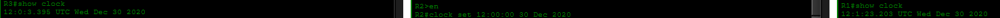
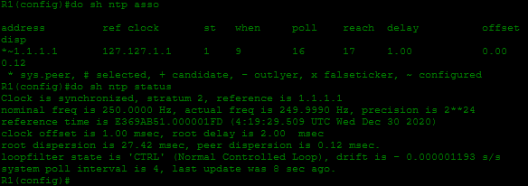
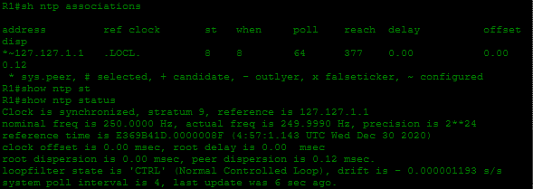

# Laboratorio: NTP — Day 37 Lab

## Descripción general

En este laboratorio se configura **NTP (Network Time Protocol)** para sincronizar los relojes de los routers de la red. Se utiliza un servidor NTP externo como referencia, y luego R1 actúa como maestro NTP para R2 y R3, usando autenticación.

## Topología

La red consta de tres routers (R1, R2, R3) con OSPF preconfigurado. R1 tiene acceso a Internet para alcanzar el servidor NTP `1.1.1.1`.

## 1. Configurar el reloj de software

Se establece la misma fecha y hora inicial en todos los routers.

```cisco
R1#clock set 12:00:00 30 Dec 2020
R2#clock set 12:00:00 30 Dec 2020
R3#clock set 12:00:00 30 Dec 2020
```



## 2. Configurar la zona horaria

Se configura la zona horaria CET (UTC+1) en todos los routers.

```cisco
R1(config)#clock timezone CET 1
R2(config)#clock timezone CET 1
R3(config)#clock timezone CET 1
```

## 3. Sincronizar R1 con un servidor NTP externo

R1 se sincroniza con el servidor NTP `1.1.1.1` a través de Internet.

```cisco
R1(config)#ntp server 1.1.1.1
```

El servidor externo tiene **stratum 1**. R1, al sincronizarse con él, queda como **stratum 2**.



## 4. Configurar R1 como maestro NTP y sincronizar R2 y R3

### R1 — Maestro NTP

Se configura R1 como maestro NTP con stratum 9 (por si pierde conexión con el servidor externo, sigue sirviendo como referencia). También se activa la autenticación NTP.

```cisco
R1(config)#ntp master 9
R1(config)#ntp authenticate
R1(config)#ntp authentication-key 1 md5 javier
R1(config)#ntp trusted-key 1
```



### R2 — Cliente NTP

```cisco
R2(config)#ntp authenticate
R2(config)#ntp authentication-key 1 md5 javier
R2(config)#ntp trusted-key 1
R2(config)#ntp server 192.168.12.1 key 1
```

### R3 — Cliente NTP

```cisco
R3(config)#ntp authenticate
R3(config)#ntp authentication-key 1 md5 javier
R3(config)#ntp trusted-key 1
R3(config)#ntp server 192.168.13.1 key 1
```

## 5. Actualizar el calendario de hardware

NTP puede actualizar también el calendario interno del router (hardware clock).

```cisco
R1(config)#ntp update-calendar
R2(config)#ntp update-calendar
R3(config)#ntp update-calendar
```

## Resumen de la configuración

| Dispositivo | Rol              | Servidor NTP       | Autenticación       |
| ----------- | ---------------- | ------------------ | ------------------- |
| 1.1.1.1     | Servidor externo | —                  | —                   |
| R1          | Cliente/Maestro  | 1.1.1.1            | Key 1: `javier`     |
| R2          | Cliente          | 192.168.12.1 (R1)  | Key 1: `javier`     |
| R3          | Cliente          | 192.168.13.1 (R1)  | Key 1: `javier`     |

## Resumen de comandos

| Comando                                     | Descripción                                      |
| ------------------------------------------- | ------------------------------------------------ |
| `clock set <hh:mm:ss> <día> <mes> <año>`    | Configura el reloj de software manualmente        |
| `clock timezone <nombre> <offset>`           | Define la zona horaria del router                |
| `ntp server <ip>`                           | Configura el router como cliente NTP             |
| `ntp master <stratum>`                      | Configura el router como maestro NTP             |
| `ntp authenticate`                          | Activa la autenticación NTP                      |
| `ntp authentication-key <id> md5 <clave>`   | Crea una clave de autenticación NTP              |
| `ntp trusted-key <id>`                      | Marca una clave como confiable                   |
| `ntp server <ip> key <id>`                  | Cliente NTP con clave de autenticación           |
| `ntp update-calendar`                       | Sincroniza el calendario de hardware con NTP     |
| `show ntp status`                           | Muestra el estado de la sincronización NTP       |
