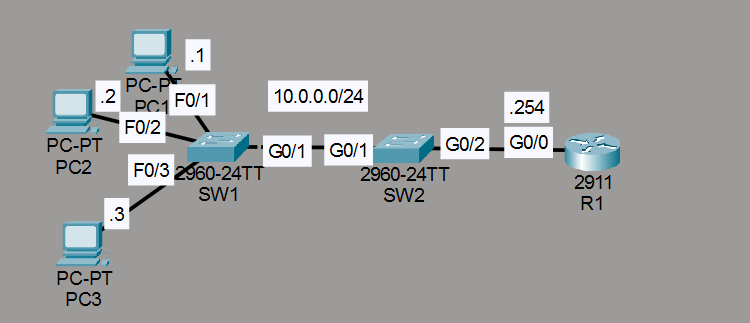
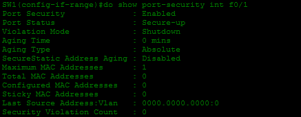
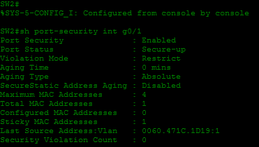
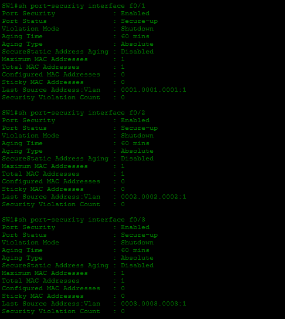
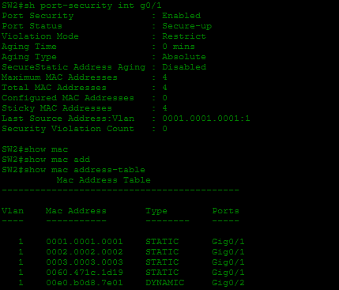
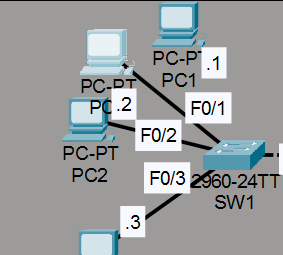
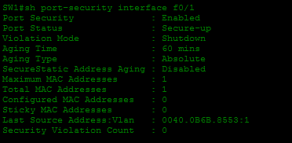
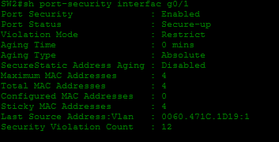
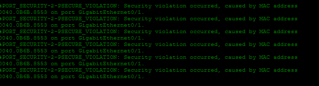
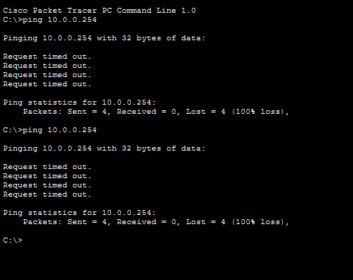

# Laboratorio: Port Security — Day 49 Lab

## Descripción general

En este laboratorio se configura **Port Security** en switches para controlar qué dispositivos pueden conectarse a cada puerto. Se prueban diferentes modos de violación y se observa cómo reacciona cada switch ante un dispositivo no autorizado.

## Topología



## 1. Configurar Port Security en SW1

Interfaces F0/1, F0/2, F0/3 con violación shutdown, máximo 1 MAC y aging de 1 hora.

```cisco
SW1(config)#int range f0/1-3
SW1(config-if-range)#switchport mode access
SW1(config-if-range)#switchport port-security
SW1(config-if-range)#switchport port-security aging time 60
```



## 2. Configurar Port Security en SW2

Interfaz G0/1 con violación restrict, máximo 4 MACs y sticky learning.

```cisco
SW2(config)#int g0/1
SW2(config-if)#switchport mode access
SW2(config-if)#switchport port-security
SW2(config-if)#switchport port-security violation restrict
SW2(config-if)#switchport port-security maximum 4
SW2(config-if)#switchport port-security mac-address sticky
```



## 3. Funcionamiento normal

Todos los PCs hacen ping al router (10.0.0.254) sin problemas.



SW2 ha aprendido las 4 MACs permitidas en modo sticky.



## 4. Probar violaciones de seguridad

Se conecta un nuevo PC a la red.



### Comportamiento de SW1

SW1 **no detecta violación** porque el puerto no tiene una MAC estática configurada ni ha aprendido ninguna MAC previamente, por lo que simplemente permite el paso.



### Comportamiento de SW2

SW2 **detecta múltiples violaciones**. El puerto G0/1 ya alcanzó el máximo de 4 MACs, por lo que descarta el tráfico del nuevo PC.



Los logs en la CLI confirman las violaciones de seguridad.



Los pings desde el nuevo PC muestran `Request timed out`.



## Resumen de comandos

| Comando                                            | Descripción                                      |
| -------------------------------------------------- | ------------------------------------------------ |
| `switchport port-security`                         | Activa Port Security en la interfaz              |
| `switchport port-security maximum <num>`           | Define el máximo de direcciones MAC permitidas   |
| `switchport port-security violation <modo>`        | Define el modo de violación (shutdown, restrict, protect) |
| `switchport port-security mac-address sticky`      | Activa el aprendizaje dinámico sticky            |
| `switchport port-security aging time <minutos>`    | Configura el tiempo de envejecimiento de las MACs |
| `show port-security`                               | Muestra la configuración de Port Security        |
| `show port-security interface <int>`               | Muestra el estado de Port Security en una interfaz |
