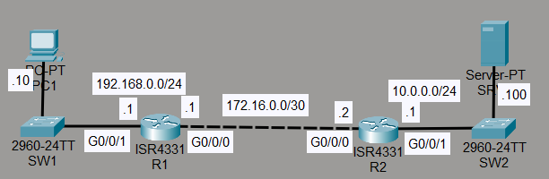
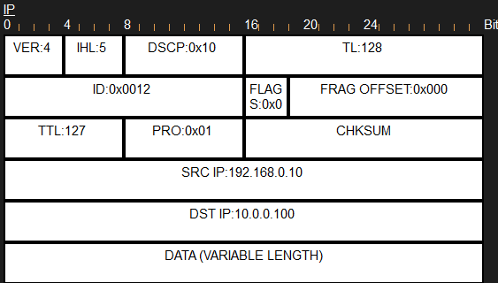
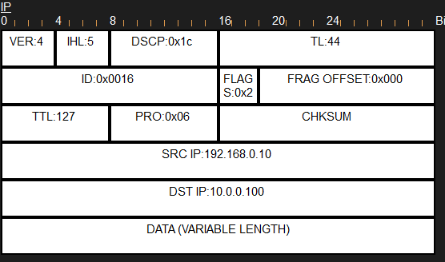
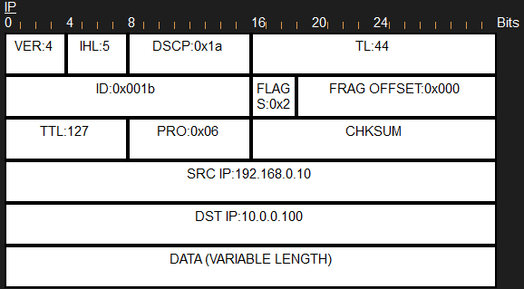

# Laboratorio: QoS — Day 47 Lab

## Descripción general

En este laboratorio se configura **QoS (Quality of Service)** en R1 para clasificar y marcar el tráfico según su tipo, asignando un ancho de banda mínimo a cada clase.

## Topología



## Configuración de QoS

### 1. Clasificar el tráfico con class-maps

```cisco
R1(config)#class-map HTTPS_MAP
R1(config-cmap)#match protocol https
!
R1(config)#class-map HTTP_MAP
R1(config-cmap)#match protocol http
!
R1(config)#class-map ICMP_MAP
R1(config-cmap)#match protocol icmp
```

### 2. Crear la policy-map con las marcas y garantías de ancho de banda

```cisco
R1(config)#policy-map g0/0/0_OUT
!
R1(config-pmap)#class HTTPS_MAP
R1(config-pmap-c)#set ip dscp AF31
R1(config-pmap-c)#priority percent 10
!
R1(config-pmap)#class HTTP_MAP
R1(config-pmap-c)#set ip dscp af32
R1(config-pmap-c)#bandwidth percent 10
!
R1(config-pmap)#class ICMP_MAP
R1(config-pmap-c)#set ip dscp cs2
R1(config-pmap-c)#bandwidth percent 5
```

### 3. Aplicar la policy-map a la interfaz de salida

```cisco
R1(config)#int g0/0/0
R1(config-if)#service-policy output g0/0/0_OUT
```

## 4. Verificación de las marcas DSCP

### ICMP (ping)

Al hacer ping desde PC1 a `10.0.0.100`, el paquete ICMP está marcado con **CS2**.



### HTTP

Al acceder a `jeremysitlab.com` por HTTP, el paquete está marcado con **AF32**.



### HTTPS

Al acceder por HTTPS, el paquete está marcado con **AF31**.



## Resumen de la configuración

| Tráfico | Clase        | Marcado DSCP | Garantía de ancho de banda |
| ------- | ------------ | ------------ | -------------------------- |
| HTTPS   | HTTPS_MAP    | AF31 (26)    | 10% (priority queue)       |
| HTTP    | HTTP_MAP     | AF32 (28)    | 10%                        |
| ICMP    | ICMP_MAP     | CS2 (16)     | 5%                         |

## Resumen de comandos

| Comando                                         | Descripción                                      |
| ----------------------------------------------- | ------------------------------------------------ |
| `class-map <nombre>`                            | Crea un mapa de clase para clasificar tráfico    |
| `match protocol <protocolo>`                    | Coincide tráfico por protocolo                   |
| `policy-map <nombre>`                           | Crea un mapa de políticas                        |
| `set ip dscp <valor>`                           | Marca los paquetes con un valor DSCP             |
| `priority percent <porcentaje>`                 | Asigna un porcentaje como cola de prioridad      |
| `bandwidth percent <porcentaje>`                | Reserva un porcentaje de ancho de banda          |
| `service-policy output <nombre>`                | Aplica la política a la salida de una interfaz   |
