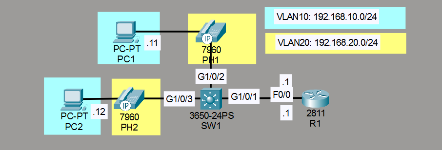
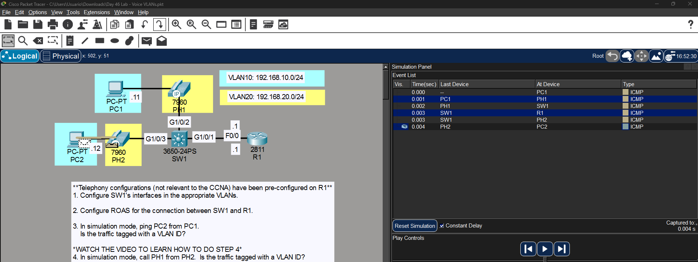
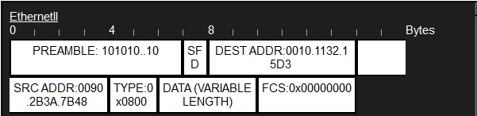
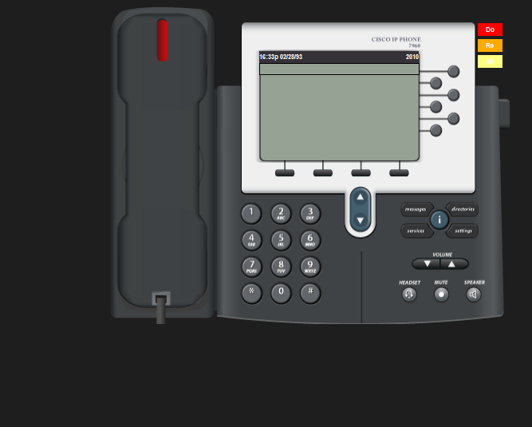
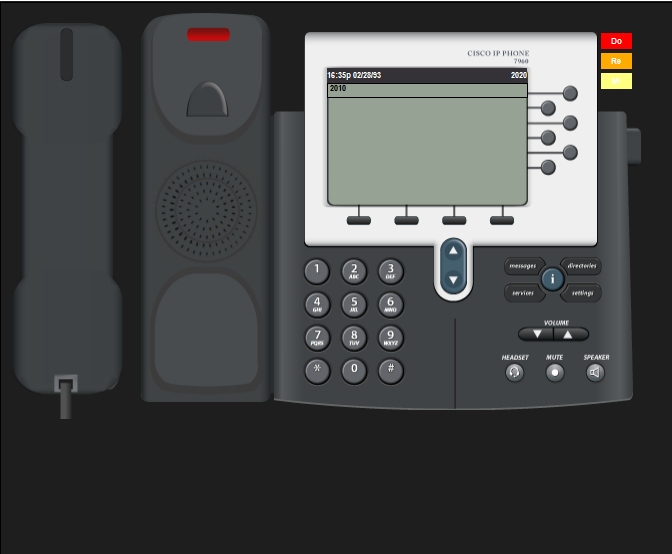
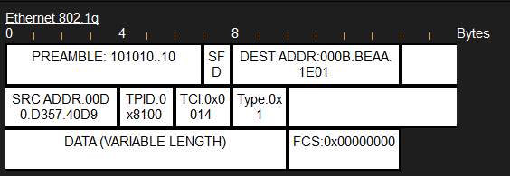
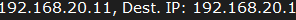

# Laboratorio: Voice VLANs — Day 46 Lab

## Descripción general

En este laboratorio se configuran **Voice VLANs** para separar el tráfico de datos y el tráfico de voz en una red con teléfonos IP. Los teléfonos reciben su número y configuración automáticamente a través del router.

## Topología



La red consta de:

- **SW1**: Switch con datos (VLAN 10) y voz (VLAN 20)
- **R1**: Router con ROAS para ambas VLANs y telefonía preconfigurada
- **PC1, PC2**: Dispositivos de datos en VLAN 10
- **PH1, PH2**: Teléfonos IP en VLAN 20

## 1. Configurar las interfaces del switch

Las interfaces hacia los teléfonos se configuran con una VLAN de datos (access) y una VLAN de voz (voice). El teléfono etiquetará su propio tráfico en la voice VLAN.

```cisco
SW1(config)#int g1/0/2
SW1(config-if)#switchport mode access
SW1(config-if)#switchport access vlan 10
SW1(config-if)#switchport voice vlan 20
!
SW1(config-if)#int g1/0/3
SW1(config-if)#switchport mode access
SW1(config-if)#switchport access vlan 10
SW1(config-if)#switchport voice vlan 20
```

### Trunk hacia R1

```cisco
SW1(config)#int g1/0/1
SW1(config-if)#switchport mode trunk
SW1(config-if)#switchport trunk allowed vlan 10,20
```

## 2. Configurar ROAS en R1

```cisco
R1(config)#int f0/0
R1(config-if)#no shutdown
!
R1(config)#int f0/0.10
R1(config-subif)#encapsulation dot1Q 10
R1(config-subif)#ip address 192.168.10.1 255.255.255.0
!
R1(config-subif)#int f0/0.20
R1(config-subif)#encapsulation dot1Q 20
R1(config-subif)#ip address 192.168.20.1 255.255.255.0
```

## 3. Tráfico entre PCs (VLAN 10)

PC1 hace ping a PC2. Ambas están en la misma VLAN, por lo que el tráfico solo pasa por el switch y **no está etiquetado** con 802.1Q.





## 4. Llamada entre teléfonos (VLAN 20)

### Marcación desde PH2

PH2 llama al número 2010 (PH1).



### Asignación de números

El R1 asignó los números de teléfono a través del switch. SW1 indica a los teléfonos en qué VLAN de voz se encuentran y R1 les asigna los números.



### Tráfico de voz etiquetado

A diferencia del tráfico entre PCs, el tráfico de voz **sí está etiquetado** con 802.1Q (VLAN 20), ya que atraviesa el trunk hacia R1.



En el paquete se pueden ver las direcciones IP asignadas por R1 a los teléfonos.



## Resumen de comandos

| Comando                                    | Descripción                                       |
| ------------------------------------------ | ------------------------------------------------- |
| `switchport voice vlan <id>`               | Configura la VLAN de voz en una interfaz          |
| `encapsulation dot1Q <vlan>`               | Activa 802.1Q en la subinterfaz del router        |
