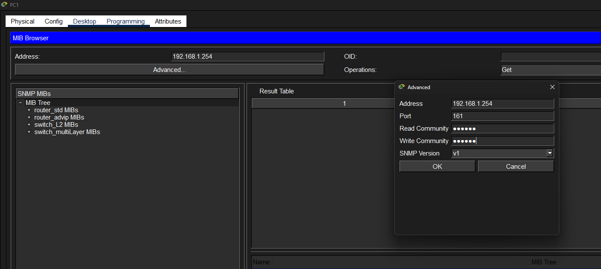
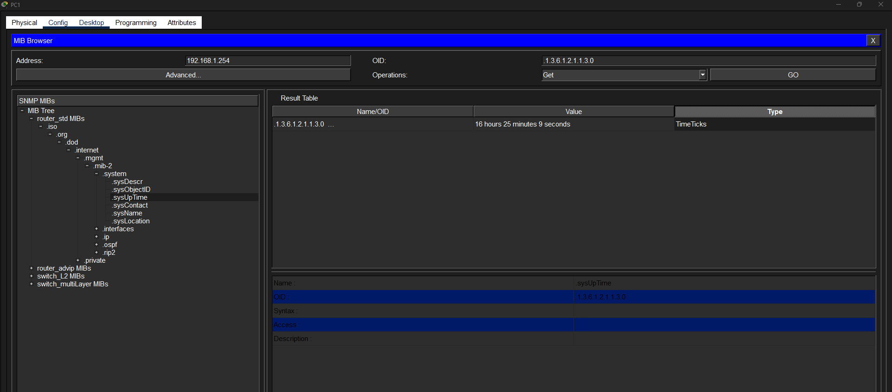
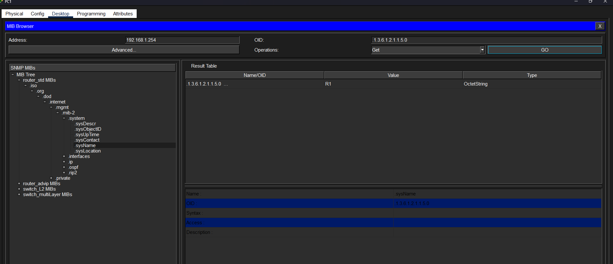
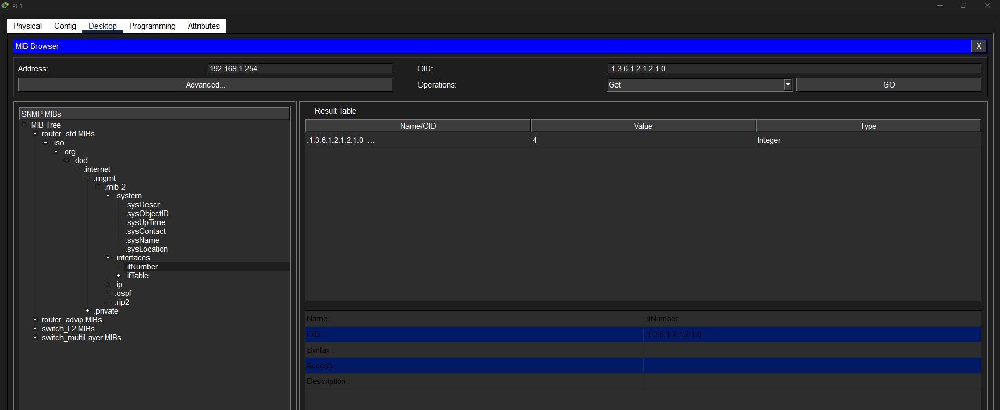
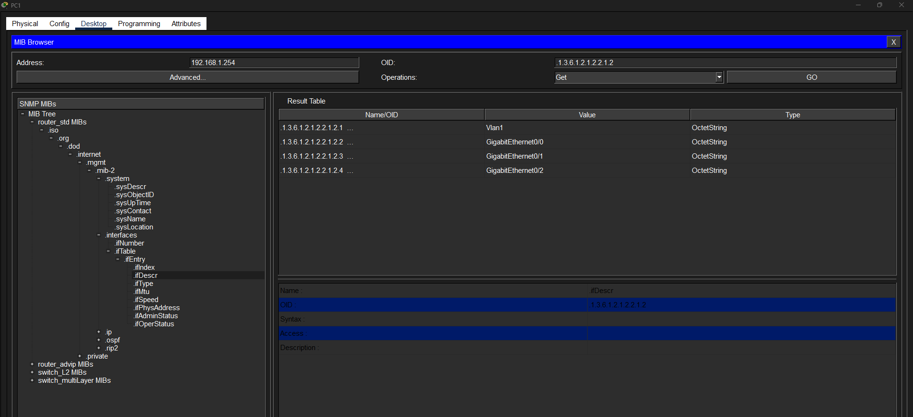
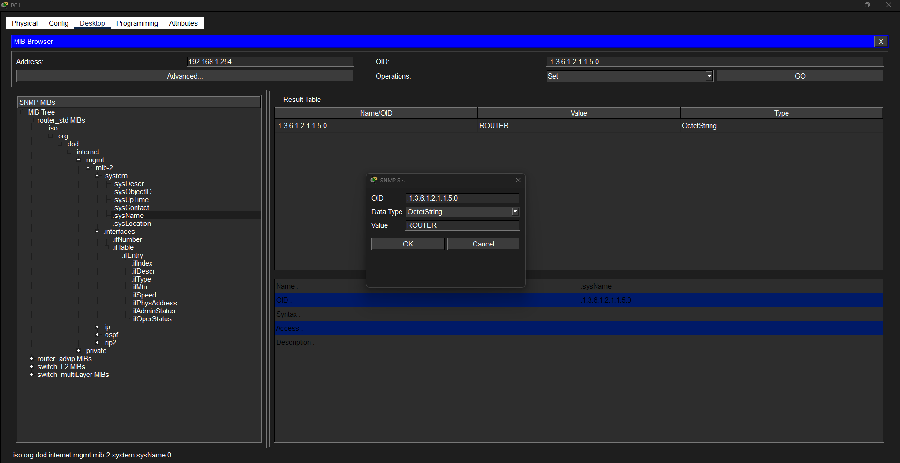

# Laboratorio: SNMP — Day 40 Lab

## Descripción general

En este laboratorio se configura **SNMP (Simple Network Management Protocol)** en un router y se utilizan mensajes Get y Set desde un navegador MIB para consultar y modificar información del dispositivo.

> **Nota:** La funcionalidad SNMP en Packet Tracer es muy limitada.

## 1. Configurar comunidades SNMP en R1

Se configuran dos comunidades SNMP: una de solo lectura y otra de lectura/escritura.

```cisco
R1(config)#snmp-server community Cisco1 ro
R1(config)#snmp-server community Cisco2 rw
```

## 2. Consultas SNMP Get desde PC1

Se abre el navegador MIB en PC1 y se configuran las comunidades:

- **Read Community:** `Cisco1`
- **Write Community:** `Cisco2`



### System Uptime

Tiempo que lleva el router funcionando desde el último reinicio.



### Nombre del host

Nombre configurado actualmente en R1.



### Número de interfaces

Cantidad total de interfaces que tiene R1.



### Lista de interfaces

Identificación de cada interfaz del router.



## 3. Modificar el hostname con SNMP Set

Se utiliza un mensaje SNMP Set para cambiar el nombre del router. El valor se introduce como OctetString para aceptar caracteres alfabéticos.



### Verificación del cambio

En la CLI del router se confirma que el hostname ha cambiado correctamente.


## Resumen de comandos

| Comando                                     | Descripción                                      |
| ------------------------------------------- | ------------------------------------------------ |
| `snmp-server community <nombre> ro`         | Configura una comunidad SNMP de solo lectura     |
| `snmp-server community <nombre> rw`         | Configura una comunidad SNMP de lectura/escritura |
