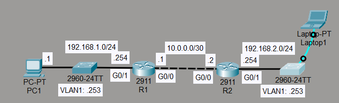
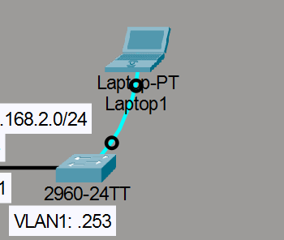
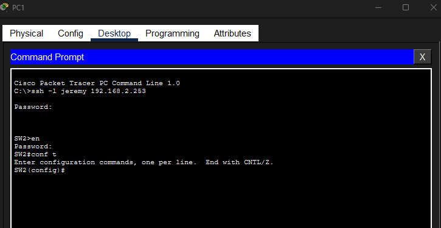

# Laboratorio: SSH — Day 42 Lab

## Descripción general

En este laboratorio se configura un switch nuevo (SW2) mediante consola y luego se habilita el acceso remoto por **SSH** para administrarlo de forma segura desde la red.

## Topología



SW2 es un switch nuevo agregado a la red. Se conecta una laptop (Laptop1) directamente al puerto de consola para realizar la configuración inicial.

## 1. Configuración inicial por consola

Se conecta Laptop1 al puerto de consola de SW2.



### Configuración básica

```cisco
Switch(config)#hostname SW2
SW2(config)#enable secret ccna
SW2(config)#username jeremy secret ccna
SW2(config)#interface vlan1
SW2(config-if)#ip address 192.168.2.253 255.255.255.0
SW2(config-if)#no shutdown
SW2(config)#ip default-gateway 192.168.2.254
```

## 2. Configurar la línea de consola

Se establece autenticación con usuario local y timeout de 5 minutos.

```cisco
SW2(config)#line console 0
SW2(config-line)#login local
SW2(config-line)#exec-timeout 5 00
```

## 3. Configurar SSH

### Crear el dominio y generar las claves RSA

```cisco
SW2(config)#ip domain name jeremysitlab.com
SW2(config)#crypto key generate rsa
```

Se elige un tamaño de clave de **2048 bits**.

```
The name for the keys will be: SW2.jeremysitlab.com
Choose the size of the key modulus in the range of 360 to 4096 for your
General Purpose Keys. Choosing a key modulus greater than 512 may take
a few minutes.

How many bits in the modulus [512]: 2048
% Generating 2048 bit RSA keys, keys will be non-exportable...[OK]
```

### Configurar las líneas VTY

Se configura SSH como único protocolo de acceso, autenticación local, timeout de 5 minutos, y se limita el acceso solo a PC1 (192.168.1.1).

```cisco
SW2(config)#access-list 2 permit host 192.168.1.1
SW2(config)#ip ssh version 2
SW2(config)#line vty 0 15
SW2(config-line)#login local
SW2(config-line)#exec-timeout 5 00
SW2(config-line)#transport input ssh
SW2(config-line)#access-class 2 in
```

### Verificación

Desde PC1 se accede a SW2 mediante SSH.



## Resumen de comandos

| Comando                                    | Descripción                                      |
| ------------------------------------------ | ------------------------------------------------ |
| `enable secret <clave>`                    | Configura la contraseña de enable                |
| `username <user> secret <clave>`           | Crea un usuario local con contraseña cifrada     |
| `ip default-gateway <ip>`                  | Configura el gateway por defecto en un switch    |
| `login local`                              | Usa autenticación local en la línea              |
| `exec-timeout <minutos> <segundos>`        | Configura el timeout de inactividad              |
| `ip domain name <dominio>`                 | Define el dominio del dispositivo                |
| `crypto key generate rsa`                  | Genera claves RSA para SSH                       |
| `ip ssh version 2`                         | Fuerza el uso de SSH versión 2                   |
| `transport input ssh`                      | Limita el acceso VTY solo a SSH                  |
| `access-class <num> in`                    | Aplica una ACL a las líneas VTY                  |
