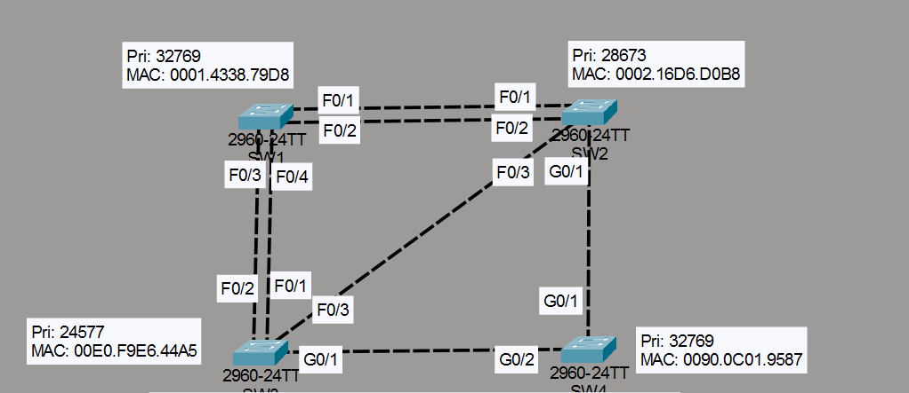
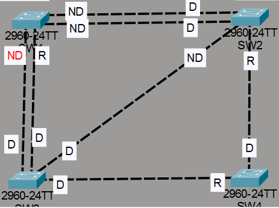

# Laboratorio: Analyzing STP — Day 20 Lab

## Descripción general

En este laboratorio se analiza manualmente la topología de **STP (Spanning Tree Protocol)** en una red de switches. A partir de la topología dada, se determina el root bridge, los root ports, designated ports y non-designated ports.

> **Nota:** Este laboratorio se realiza con las luces de los enlaces desactivadas en Packet Tracer (Options → Preferences → Show Link Lights).

## Topología

## Determinación del root bridge

**SW3** es el root bridge porque tiene la prioridad más baja de todos los switches. Como root bridge, todos sus puertos son **designated ports**.

## Root ports

Cada switch no root elige un root port (RP), que es el puerto con la ruta de menor costo hacia el root bridge.

| Switch | Root Port | Motivo                                                  |
| ------ | --------- | ------------------------------------------------------- |
| SW4    | g0/2      | Tiene el costo root más bajo (4)                        |
| SW1    | f0/4      | Conectado al puerto de SW3 con el port-id más bajo      |
| SW2    | g0/2      | Costo root de 12 a través de SW4, menor que 19 por f0/3 |

## Designated ports

Un designated port (DP) es el puerto que tiene el mejor camino hacia el root bridge en cada segmento.

| Switch | Puertos designated | Motivo                                                       |
| ------ | ------------------ | ------------------------------------------------------------ |
| SW3    | Todos              | Es el root bridge                                             |
| SW4    | g0/1               | Necesita enviar tráfico hacia el root port g0/1 de SW2       |
| SW2    | f0/1, f0/2         | Tiene un costo root más bajo (31) que los mismos puertos en SW1 (38) |

## Non-designated ports

Los puertos non-designated (ND) son aquellos que quedan en estado blocking para evitar bucles.

| Switch | Puertos non-designated |
| ------ | ---------------------- |
| SW1    | f0/3, f0/1, f0/2      |
| SW2    | f0/3                   |

## Resultado final

La topología STP resultante queda de la siguiente manera:

