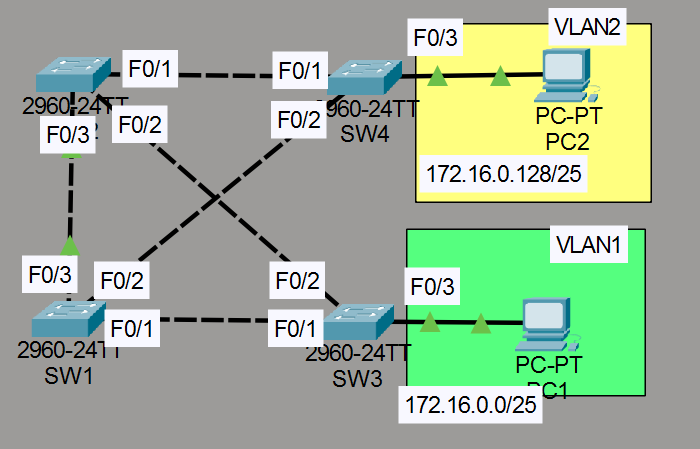
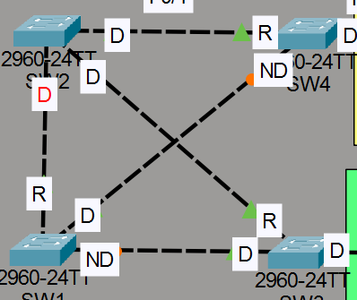
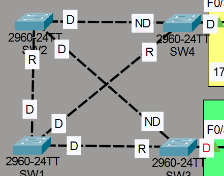
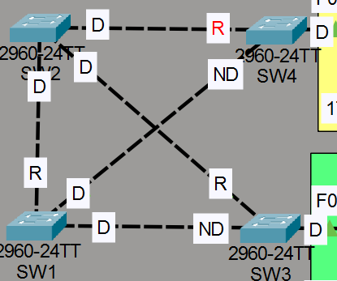

# Laboratorio: Configuring Spanning Tree — Day 21 Lab

## Descripción general

En este laboratorio se analiza y modifica el comportamiento de **STP (Spanning Tree Protocol)** en una red con switches en anillo. Se cambia el root bridge por VLAN, se modifican costos y prioridades de puertos, y se configuran PortFast y BPDU Guard en puertos de acceso.

## Topología



La red consta de 4 switches (SW1, SW2, SW3, SW4) conectados en una topología redundante con múltiples caminos entre ellos.

## 1. Verificación de la topología STP inicial

Usando `show spanning-tree` en cada switch se determina el root bridge actual y el rol de cada puerto (Root, Designated, Alternate/Blocking).



En la topología inicial, STP elige un root bridge y bloquea los puertos necesarios para eliminar bucles.

## 2. Configurar root bridges por VLAN

Se configura un root bridge primario y uno secundario diferente para cada VLAN, permitiendo balanceo de carga.

```cisco
! VLAN 1: SW1 como root primario, SW2 como secundario
SW1(config)#spanning-tree vlan 1 root primary
SW2(config)#spanning-tree vlan 1 root secondary

! VLAN 2: SW2 como root primario, SW1 como secundario
SW2(config)#spanning-tree vlan 2 root primary
SW1(config)#spanning-tree vlan 2 root secondary
```

### Resultado para VLAN 1

Con SW1 como root bridge, STP ajusta los roles de los puertos.



### Resultado para VLAN 2

Con SW2 como root bridge, la topología STP cambia.



## 3. Aumentar el costo de un puerto

Se incrementa el costo STP de la interfaz F0/2 de SW4 en VLAN 1 a 100.

```cisco
SW4(config-if)#spanning-tree vlan 1 cost 100
```

Esto no cambia la selección del root port porque SW4 ya tenía un puerto bloqueado (Alternate). La ruta alternativa ya tenía un costo mayor (57) frente al costo actual (19), por lo que aumentar el costo del puerto bloqueado no afecta la decisión.

## 4. Cambiar la prioridad de un puerto

Se cambia la prioridad STP de la interfaz F0/1 de SW1 en VLAN 1 a 240.

```cisco
SW1(config-if)#spanning-tree vlan 1 port-priority 240
```

Esto no afecta a SW3 porque SW1 es el root bridge en VLAN 1. Los root bridges no eligen root port; son sus puertos los que actúan como designated.

## 5. PortFast y BPDU Guard

Se configuran PortFast y BPDU Guard en las interfaces F0/3 de SW3 y SW4, que están conectadas a PCs (dispositivos finales).

### SW3

```cisco
SW3(config)#int f0/3
SW3(config-if)#spanning-tree portfast
SW3(config-if)#spanning-tree bpduguard enable
```

### SW4

```cisco
SW4(config)#int f0/3
SW4(config-if)#spanning-tree portfast
SW4(config-if)#spanning-tree bpduguard enable
```

- **PortFast**: hace que el puerto pase directamente al estado forwarding, evitando las fases de listening y learning. Esto acelera la conectividad de los PCs.
- **BPDU Guard**: si el puerto recibe un BPDU (lo que indicaría que otro switch está conectado), se desactiva automáticamente (errdisable).


## Resumen de comandos

| Comando                                       | Descripción                                         |
| --------------------------------------------- | --------------------------------------------------- |
| `show spanning-tree`                          | Muestra el estado de STP en el switch               |
| `spanning-tree vlan <id> root primary`        | Configura el switch como root primario para esa VLAN |
| `spanning-tree vlan <id> root secondary`      | Configura el switch como root secundario para esa VLAN |
| `spanning-tree vlan <id> cost <valor>`        | Cambia el costo STP de una interfaz para una VLAN   |
| `spanning-tree vlan <id> port-priority <valor>` | Cambia la prioridad STP de una interfaz para una VLAN |
| `spanning-tree portfast`                      | Activa PortFast en una interfaz                      |
| `spanning-tree bpduguard enable`              | Activa BPDU Guard en una interfaz                    |
