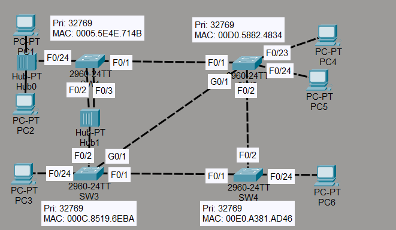
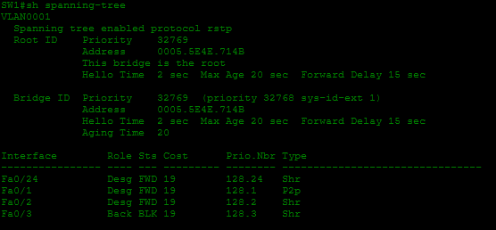
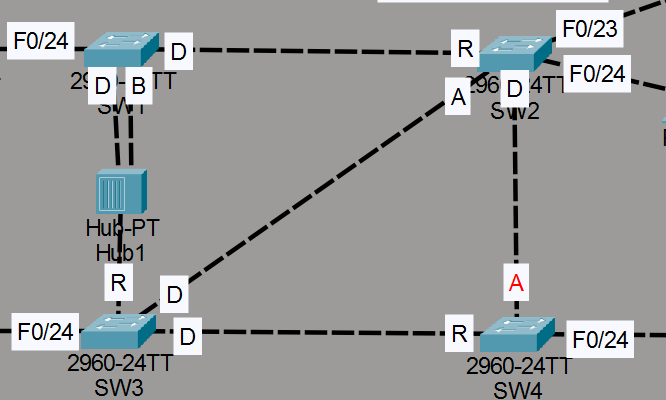

# Laboratorio: Rapid STP — Day 22 Lab

## Descripción general

En este laboratorio se analiza y configura **RSTP (Rapid Spanning Tree Protocol)** en una red de switches. Se determina el root bridge, los roles de cada puerto y se configuran manualmente los tipos de enlace RSTP (edge, point-to-point, shared).

## Topología



La red consta de 4 switches conectados entre sí y un hub conectado a SW1.

## 1. Determinación del root bridge

Todos los switches tienen la misma prioridad de bridge, por lo que se elige como root bridge el que tiene la **MAC address más baja**: **SW1** (MAC: 0005.5E4E.714B).



**Observación:** En RSTP, el root bridge tiene todos sus puertos como designated. Sin embargo, el puerto F0/3 de SW1 aparece como **backup** porque está conectado a un **hub**. En un segmento compartido donde hay múltiples puertos del mismo switch, solo uno puede ser designated; el resto queda como backup.

## 2. Análisis de roles de puertos

### Root ports

| Switch | Root Port | Criterio                                                 |
| ------ | --------- | -------------------------------------------------------- |
| SW1    | —         | Es el root bridge, no tiene root port                    |
| SW2    | f0/2      | Menor root cost (200.000)                                |
| SW3    | f0/1      | Menor root cost (200.000)                                |
| SW4    | f0/1      | Mismo root cost (600.000) pero mejor bridge ID (SW3 vs SW2) |

### Designated ports

| Switch | Puertos designated | Motivo                                                    |
| ------ | ------------------ | --------------------------------------------------------- |
| SW1    | Todos excepto f0/3 | Es el root bridge                                         |
| SW3    | f0/1, g0/1         | f0/1 envía BPDUs al root port de SW4; g0/1 tiene mejor bridge ID que SW2 |
| SW2    | f0/2               | Menor root cost (400.000) que SW4 (600.000)               |

### Alternate ports

| Switch | Puertos alternate |
| ------ | ----------------- |
| SW2    | g0/1              |
| SW4    | f0/2              |

### Backup ports

| Switch | Puertos backup | Motivo                                        |
| ------ | -------------- | --------------------------------------------- |
| SW1    | f0/3           | Puerto en segmento compartido (hub) con port-id más alto |

### Resultado final



## 3. Configuración manual de tipos de enlace RSTP

### SW1

```cisco
! Puerto hacia hub con PCs (edge)
SW1(config)#int f0/24
SW1(config-if)#spanning-tree portfast

! Puertos hacia hub compartido (shared)
SW1(config)#int range f0/2-3
SW1(config-if-range)#spanning-tree link-type shared

! Puerto punto a punto hacia otro switch
SW1(config)#int f0/1
SW1(config-if)#spanning-tree link-type point-to-point
```

### SW2

```cisco
SW2(config)#int range f0/1-2
SW2(config-if-range)#spanning-tree link-type point-to-point
!
SW2(config-if-range)#int range f0/23-24
SW2(config-if-range)#spanning-tree portfast
!
SW2(config-if-range)#int g0/1
SW2(config-if)#spanning-tree link-type point-to-point
```

### SW3

```cisco
SW3(config)#int range f0/2, g0/1, f0/1
SW3(config-if-range)#spanning-tree link-type point-to-point
!
SW3(config-if-range)#int f0/24
SW3(config-if)#spanning-tree portfast
```

### SW4

```cisco
SW4(config)#int range f0/1-2
SW4(config-if-range)#spanning-tree link-type point-to-point
!
SW4(config-if-range)#int f0/24
SW4(config-if)#spanning-tree portfast
```

### Tipos de enlace en RSTP

| Tipo          | Descripción                                                  |
| ------------- | ------------------------------------------------------------ |
| **Edge**      | Puerto conectado solo a dispositivos finales (PCs, servidores). Se configura con PortFast. |
| **Point-to-point** | Conexión directa entre dos switches.                        |
| **Shared**    | Conexión a un segmento compartido (hub) donde puede haber otros switches. |

## Resumen de comandos

| Comando                                       | Descripción                                   |
| --------------------------------------------- | --------------------------------------------- |
| `spanning-tree link-type point-to-point`      | Configura el enlace como punto a punto        |
| `spanning-tree link-type shared`              | Configura el enlace como compartido           |
