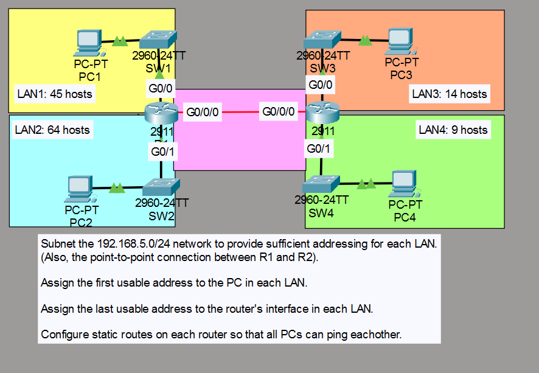
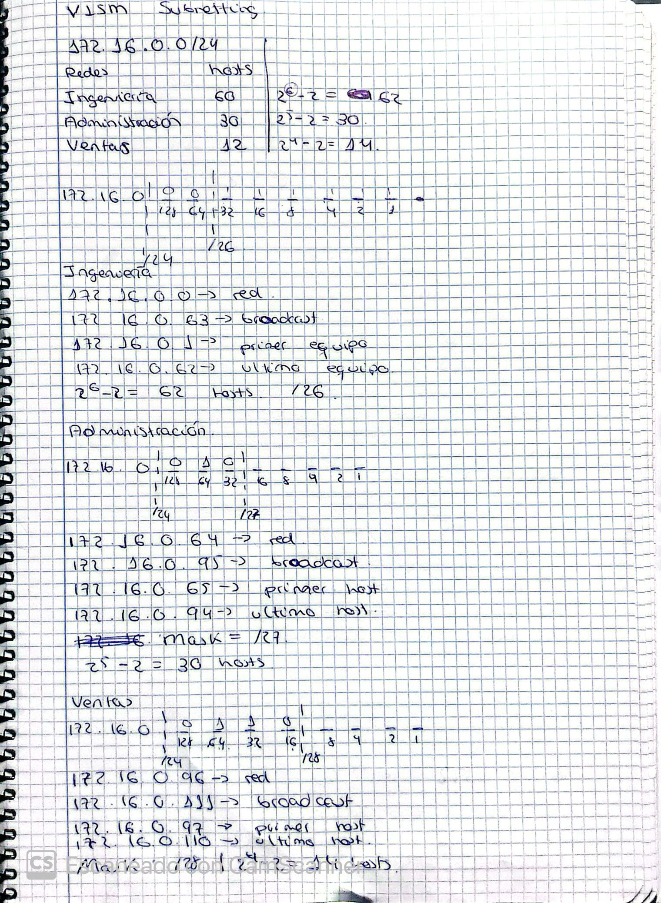
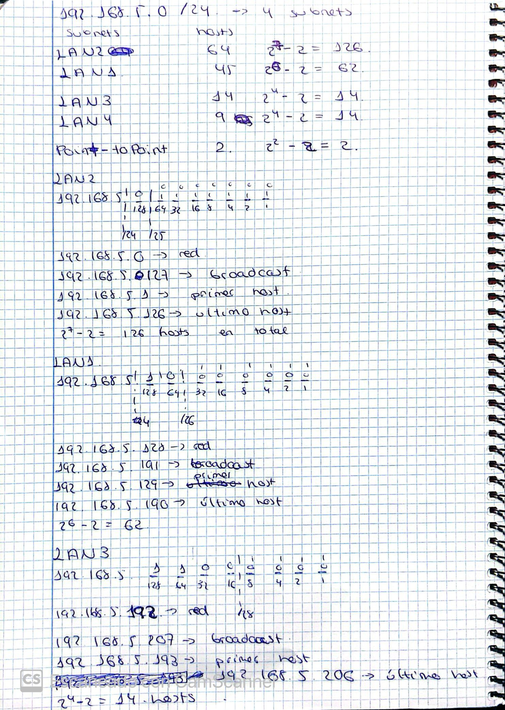
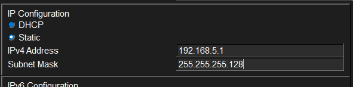
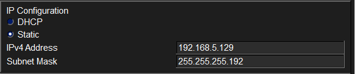
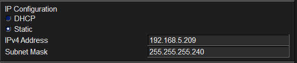

# Laboratorio: Subnetting (VLSM) - Day 15 Lab

## Descripción general

En este laboratorio se aplica VLSM a la red `192.168.5.0/24` para crear subredes que se adapten a cada LAN y al enlace punto a punto entre dos routers. Se asignan direcciones IP, se configuran las interfaces y se establecen rutas estáticas para lograr conectividad entre todas las PCs.

## Requisitos del ejercicio

1. Subdividir la red `192.168.5.0/24` usando VLSM.
2. Asignar la **primera dirección útil** a la PC de cada LAN.
3. Asignar la **última dirección útil** a la interfaz del router en cada LAN.
4. Configurar rutas estáticas en ambos routers para que todas las PCs puedan comunicarse.

## Topología



## Cálculos de subredes (VLSM)

Se ordenaron las redes de mayor a menor cantidad de hosts necesarios y se asignaron los bloques de direcciones de forma consecutiva.




### Tabla de subredes

| Red          | Máscara          | CIDR | Dirección de red | Primer host | Último host | Broadcast      |
| ------------ | ---------------- | ---- | ---------------- | ----------- | ----------- | -------------- |
| LAN2         | 255.255.255.128  | /25  | 192.168.5.0      | 192.168.5.1 | 192.168.5.126 | 192.168.5.127 |
| LAN1         | 255.255.255.192  | /26  | 192.168.5.128    | 192.168.5.129 | 192.168.5.190 | 192.168.5.191 |
| LAN3         | 255.255.255.240  | /28  | 192.168.5.192    | 192.168.5.193 | 192.168.5.206 | 192.168.5.207 |
| LAN4         | 255.255.255.240  | /28  | 192.168.5.208    | 192.168.5.209 | 192.168.5.222 | 192.168.5.223 |
| P2P (R1-R2)  | 255.255.255.252  | /30  | 192.168.5.224    | 192.168.5.225 | 192.168.5.226 | 192.168.5.227 |

## Asignación de direcciones

| Dispositivo | Interfaz  | Dirección IP     | Máscara           | Gateway       |
| ----------- | --------- | ---------------- | ----------------- | ------------- |
| PC LAN2     | NIC       | 192.168.5.1      | 255.255.255.128   | 192.168.5.126 |
| R1 LAN2     | g0/1      | 192.168.5.126    | 255.255.255.128   | —             |
| PC LAN1     | NIC       | 192.168.5.129    | 255.255.255.192   | 192.168.5.190 |
| R1 LAN1     | g0/0      | 192.168.5.190    | 255.255.255.192   | —             |
| PC LAN3     | NIC       | 192.168.5.193    | 255.255.255.240   | 192.168.5.206 |
| R2 LAN3     | g0/0      | 192.168.5.206    | 255.255.255.240   | —             |
| PC LAN4     | NIC       | 192.168.5.209    | 255.255.255.240   | 192.168.5.222 |
| R2 LAN4     | g0/1      | 192.168.5.222    | 255.255.255.240   | —             |
| R1 P2P      | g0/0/0    | 192.168.5.225    | 255.255.255.252   | —             |
| R2 P2P      | g0/0/0    | 192.168.5.226    | 255.255.255.252   | —             |

## Configuración de los routers

### R1 — LAN2



```cisco
R1(config)#int g0/1
R1(config-if)#ip address 192.168.5.126 255.255.255.128
R1(config-if)#desc ## to  SW2 ##
R1(config-if)#no shutdown
```

### R1 — LAN1



```cisco
R1(config-if)#int g0/0
R1(config-if)#ip address 192.168.5.190 255.255.255.192
R1(config-if)#desc ## to SW1 ##
R1(config-if)#no shutdown
```

### R2 — LAN3


```cisco
R2(config)#int g0/0
R2(config-if)#ip address 192.168.5.206 255.255.255.240
R2(config-if)#desc ## to SW3 ##
R2(config-if)#no shutdown
```

### R2 — LAN4



```cisco
R2(config-if)#int g0/1
R2(config-if)#ip address 192.168.5.222 255.255.255.240
R2(config-if)#desc ## to SW4 ##
R2(config-if)#no shutdown
```

### Enlace punto a punto (P2P)

```cisco
R1(config)#int g0/0/0
R1(config-if)#ip address 192.168.5.225 255.255.255.252
R1(config-if)#desc ## to R2 ##
R1(config-if)#no shutdown

R2(config)#int g0/0/0
R2(config-if)#ip address 192.168.5.226 255.255.255.252
R2(config-if)#desc ## to R1 ##
R2(config-if)#no shutdown
```

## Rutas estáticas

Para que las PCs detrás de R1 y R2 puedan comunicarse entre sí, es necesario indicar manualmente las rutas hacia las redes del lado contrario.

### R1 (redes locales: LAN1 y LAN2)

R1 necesita alcanzar LAN3 y LAN4 a través de R2.

```cisco
R1(config)#ip route 192.168.5.192 255.255.255.240 g0/0/0 192.168.5.226
R1(config)#ip route 192.168.5.208 255.255.255.240 g0/0/0 192.168.5.226
```

### R2 (redes locales: LAN3 y LAN4)

R2 necesita alcanzar LAN1 y LAN2 a través de R1.

```cisco
R2(config)#ip route 192.168.5.0 255.255.255.128 g0/0/0 192.168.5.225
R2(config)#ip route 192.168.5.128 255.255.255.192 g0/0/0 192.168.5.225
```

## Resumen de conectividad

| Origen   | Destino  | Camino                            |
| -------- | -------- | --------------------------------- |
| PC LAN1  | PC LAN3  | R1 → P2P → R2                     |
| PC LAN2  | PC LAN4  | R1 → P2P → R2                     |
| PC LAN3  | PC LAN1  | R2 → P2P → R1                     |
| PC LAN4  | PC LAN2  | R2 → P2P → R1                     |

Todas las rutas estáticas utilizan la interfaz de salida (`g0/0/0`) y la dirección IP del siguiente salto (next-hop). Con esta configuración, cualquier PC en cualquier LAN debe poder hacer ping a cualquier otra PC.

## Ficha del laboratorio

| Campo       | Valor                                          |
| ----------- | ---------------------------------------------- |
| Dificultad  | ★★☆☆☆                                          |
| Tecnologías | Subnetting, Cisco IOS                     |
| Software    | Cisco Packet Tracer                             |
| Estado      | ✅ Completado                                   |
