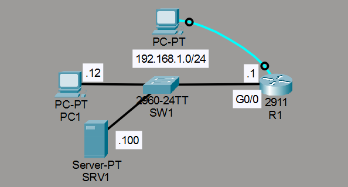
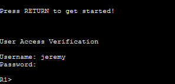
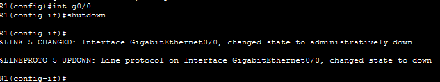
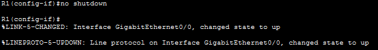
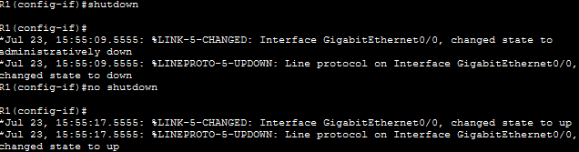
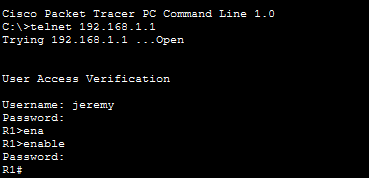
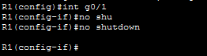
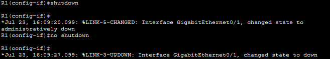
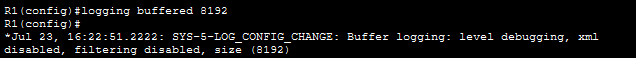
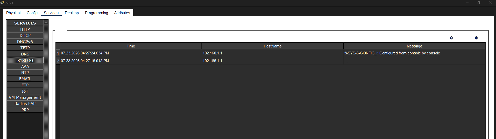

# Laboratorio: Syslog — Day 41 Lab

## Descripción general

En este laboratorio se configura **Syslog** en un router para registrar eventos del sistema. Se exploran diferentes métodos de logging: consola, VTY, buffer y servidor Syslog externo.

## Topología



La red consta de un router R1, un servidor Syslog (SRV1), dos PCs y credenciales preconfiguradas:
- Usuario: `jeremy`, contraseña: `ccna`
- Enable password: `ccna`

## 1. Conexión por consola desde PC2

Se accede a R1 desde PC2 mediante la terminal (conexión por consola).



### Desactivar y activar G0/0

```cisco
R1(config)#int g0/0
R1(config-if)#shutdown
R1(config-if)#no shutdown
```

Al desactivar la interfaz aparecen dos mensajes Syslog: uno por el cambio de estado (line protocol) y otro por el estado de la interfaz (up/down).



**Severidad:** Los mensajes tienen nivel **5 (Notice/Notification)**.



### Habilitar timestamps en los logs

```cisco
R1(config)#service timestamps log datetime msec
```

A partir de este momento, los mensajes Syslog incluyen la fecha y hora exactas.



## 2. Conexión por Telnet desde PC1

Desde PC1 se accede a R1 mediante Telnet.



### Activar G0/1

```cisco
R1(config)#int g0/1
R1(config-if)#no shutdown
```

No aparece ningún mensaje Syslog en la sesión Telnet porque el logging hacia las líneas VTY no está activado para la sesión actual.

### Habilitar logging en VTY

```cisco
R1#terminal monitor
```



Una vez activado, los mensajes Syslog aparecen en la sesión Telnet.



## 3. Logging al buffer

Se configura el logging al buffer interno del router con un tamaño de 8192 bytes.

```cisco
R1(config)#logging buffered 8192
```



## 4. Logging a un servidor Syslog externo

Se envía los logs al servidor SRV1 (192.168.1.100) con nivel debugging (los más detallados).

```cisco
R1(config)#logging host 192.168.1.100
R1(config)#logging trap debugging
```

En SRV1 se pueden ver los logs recibidos desde R1.



## Resumen de comandos

| Comando                                       | Descripción                                           |
| --------------------------------------------- | ----------------------------------------------------- |
| `service timestamps log datetime`        | Agrega fecha y hora a los mensajes Syslog             |
| `terminal monitor`                            | Muestra logs en la sesión actual (VTY)                |
| `logging buffered <tamaño>`                   | Almacena logs en el buffer interno del router         |
| `logging host <ip>`                           | Envía logs a un servidor Syslog externo               |
| `logging trap <nivel>`                        | Define el nivel de gravedad mínimo para enviar al servidor |
| `show logging`                                | Muestra la configuración y el buffer de logging       |