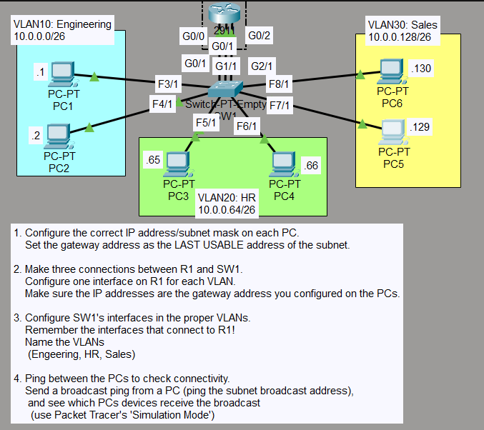
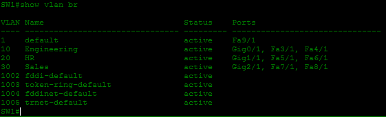
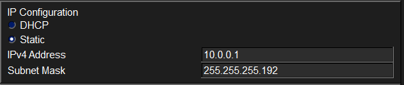
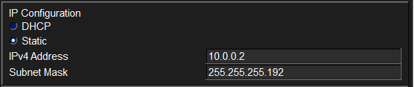
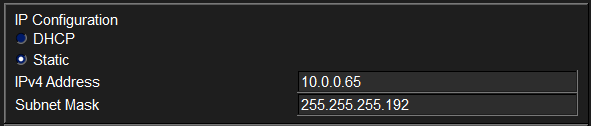
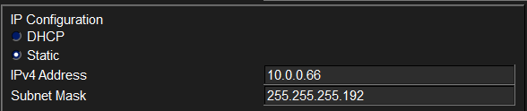
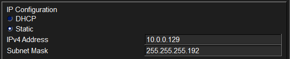
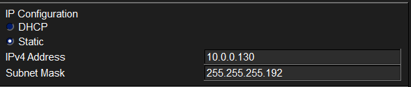
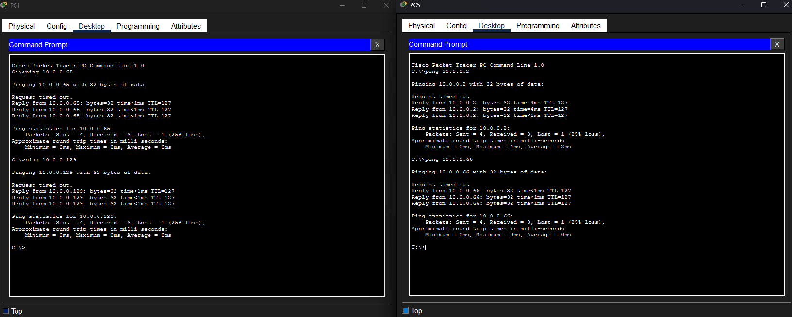
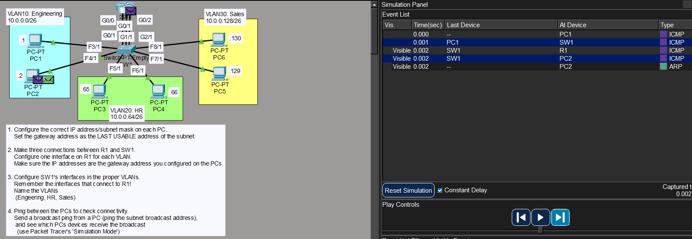

# Laboratorio: VLANs (Part 1) — Day 16 Lab

## Descripción general

Configuración VLAN básica.

## Topología



La red consiste en un router R1 conectado a un switch SW1 mediante tres enlaces (uno por VLAN). Seis PCs están distribuidas en tres VLANs.

## Direccionamiento IP

Se utiliza la red `10.0.0.0/24` dividida en subredes /26 (máscara `255.255.255.192`). Cada VLAN recibe una subred. La **última dirección útil** de cada subred se asigna a la interfaz del router (gateway).

### VLAN 10 — Engineering

| Dispositivo | IP            | Máscara           | Gateway    |
| ----------- | ------------- | ----------------- | ---------- |
| PC1         | 10.0.0.1      | 255.255.255.192   | 10.0.0.62  |
| PC2         | 10.0.0.2      | 255.255.255.192   | 10.0.0.62  |
| R1 g0/0     | 10.0.0.62     | 255.255.255.192   | —          |

### VLAN 20 — HR

| Dispositivo | IP            | Máscara           | Gateway     |
| ----------- | ------------- | ----------------- | ----------- |
| PC3         | 10.0.0.65     | 255.255.255.192   | 10.0.0.126  |
| PC4         | 10.0.0.66     | 255.255.255.192   | 10.0.0.126  |
| R1 g0/1     | 10.0.0.126    | 255.255.255.192   | —           |

### VLAN 30 — Sales

| Dispositivo | IP             | Máscara           | Gateway     |
| ----------- | -------------- | ----------------- | ----------- |
| PC5         | 10.0.0.129     | 255.255.255.192   | 10.0.0.190  |
| PC6         | 10.0.0.130     | 255.255.255.192   | 10.0.0.190  |
| R1 g0/2     | 10.0.0.190     | 255.255.255.192   | —           |

## Configuración del router (R1)

Se asigna la dirección de gateway a cada interfaz del router, una por VLAN.

```cisco
R1(config)#int g0/0
R1(config-if)#ip address 10.0.0.62 255.255.255.192
R1(config-if)#no shutdown
!
R1(config-if)#int g0/1
R1(config-if)#ip address 10.0.0.126 255.255.255.192
R1(config-if)#no shutdown
!
R1(config-if)#int g0/2
R1(config-if)#ip address 10.0.0.190 255.255.255.192
R1(config-if)#no shutdown
```

## Configuración del switch (SW1)

Las interfaces se asignan a la VLAN correspondiente en modo access. También se crean las VLANs con nombres descriptivos.

```cisco
SW1(config-if-range)#int range f3/1, f4/1, g0/1
SW1(config-if-range)#switchport mode access
SW1(config-if-range)#switchport access vlan 10
!
SW1(config-if-range)#int range f5/1, f6/1, g1/1
SW1(config-if-range)#switchport mode access
SW1(config-if-range)#switchport access vlan 20
!
SW1(config-if-range)#int range f7/1, f8/1, g2/1
SW1(config-if-range)#switchport mode access
SW1(config-if-range)#switchport access vlan 30
!
SW1(config-if-range)#vlan 10
SW1(config-vlan)#name Engineering
SW1(config-vlan)#vlan 20
SW1(config-vlan)#name HR
SW1(config-vlan)#vlan 30
SW1(config-vlan)#name Sales
```

### Mapa de puertos del switch

| Puerto | Conectado a   | VLAN | Nombre       |
| ------ | ------------- | ---- | ------------ |
| f3/1   | PC1           | 10   | Engineering  |
| f4/1   | PC2           | 10   | Engineering  |
| g0/1   | R1 g0/0       | 10   | Engineering  |
| f5/1   | PC3           | 20   | HR           |
| f6/1   | PC4           | 20   | HR           |
| g1/1   | R1 g0/1       | 20   | HR           |
| f7/1   | PC5           | 30   | Sales        |
| f8/1   | PC6           | 30   | Sales        |
| g2/1   | R1 g0/2       | 30   | Sales        |



## Configuración de las PCs

### VLAN 10 — Engineering

Gateway: `10.0.0.62`




### VLAN 20 — HR

Gateway: `10.0.0.126`




### VLAN 30 — Sales

Gateway: `10.0.0.190`




## Pruebas de conectividad

### Ping entre PCs de la misma VLAN

Dos PCs dentro de la misma VLAN deben poder comunicarse directamente a través del switch.



### Ping de broadcast

Al enviar un ping a la dirección de broadcast de la subred, solo responden los dispositivos que están en la misma VLAN. Esto demuestra que las VLANs crean dominios de broadcast independientes.



En la simulación se observa que cuando se hace ping a la dirección broadcast de una VLAN, solo lo reciben la interfaz del router y la otra PC que están en esa misma VLAN, mientras que los dispositivos de las otras VLANs no reciben el mensaje.

## Resumen de comandos

| Comando                                      | Descripción                                |
| -------------------------------------------- | ------------------------------------------ |
| `switchport mode access`                     | Configura el puerto como access            |
| `switchport access vlan <id>`                | Asigna el puerto a una VLAN                |
| `vlan <id>`                                  | Crea o accede a una VLAN                   |
| `name <nombre>`                              | Asigna un nombre a la VLAN                 |
