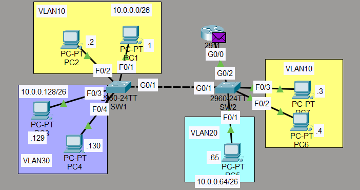
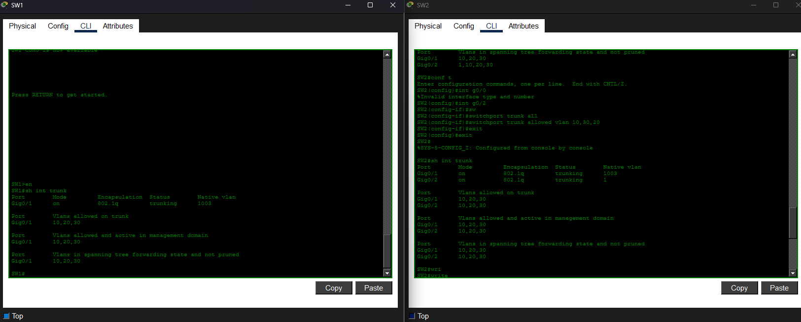
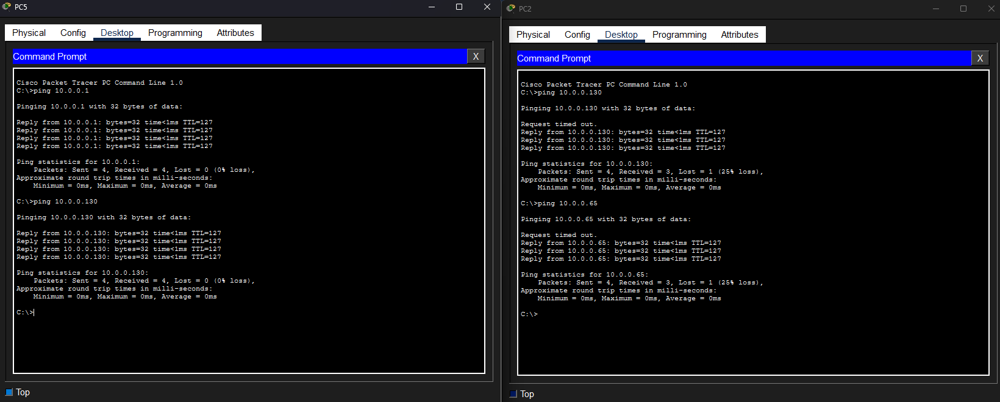
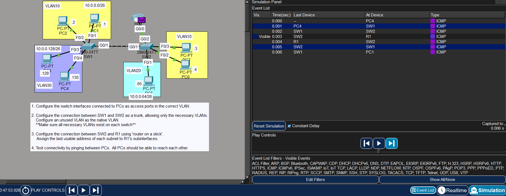

# Laboratorio: VLANs (Part 2) — Day 17 Lab

## Descripción general

En este laboratorio se amplía el uso de VLANs incorporando **enlaces trunk** entre switches y **Router on a Stick (ROAS)** para permitir la comunicación entre VLANs. Se configura un trunk que permite solo las VLANs necesarias y se utiliza una VLAN no utilizada como native VLAN por seguridad.

## Topología



La red consta de:

- **SW1**: PCs en VLAN 10 (f0/1-2) y VLAN 30 (f0/3-4)
- **SW2**: PCs en VLAN 10 (f0/2-3) y VLAN 20 (f0/1)
- **Enlace trunk** entre SW1 y SW2 (g0/1)
- **Enlace trunk** entre SW2 y R1 (g0/2)
- **R1**: Router on a Stick con subinterfaces para cada VLAN

## Direccionamiento IP

Se utiliza la red `10.0.0.0/24` dividida en tres subredes /26 (máscara `255.255.255.192`). La **última dirección útil** de cada subred se asigna a la subinterfaz de R1 (gateway).

| VLAN | Nombre | Subred              | Gateway          | PCs                           |
| ---- | ------ | ------------------- | ---------------- | ----------------------------- |
| 10   | —      | 10.0.0.0/26         | 10.0.0.62        | PC1: .1, PC2: .1, PC3: .2     |
| 20   | —      | 10.0.0.64/26        | 10.0.0.126       | PC4: .65                      |
| 30   | —      | 10.0.0.128/26       | 10.0.0.190       | PC5: .129, PC6: .130          |

## Configuración de puertos access en los switches

### SW1

```cisco
SW1(config)#int range f0/1-2
SW1(config-if-range)#switchport mode access
SW1(config-if-range)#switchport access vlan 10
!
SW1(config-if-range)#int range f0/3-4
SW1(config-if-range)#switchport mode access
SW1(config-if-range)#switchport access vlan 30
```

### SW2

```cisco
SW2(config)#int range f0/2-3
SW2(config-if-range)#switchport mode access
SW2(config-if-range)#switchport access vlan 10
!
SW2(config-if)#int f0/1
SW2(config-if)#switchport mode access
SW2(config-if)#switchport access vlan 20
```

## Configuración de enlaces trunk

Se crean las VLANs que faltan en cada switch y se configura el trunk permitiendo solo las VLANs necesarias.

```cisco
! SW1
SW1(config)#vlan 20
SW1(config)#int g0/1
SW1(config-if)#switchport mode trunk
SW1(config-if)#switchport trunk allowed vlan 10,30,20
!
! SW2
SW2(config)#vlan 30
SW2(config)#int g0/1
SW2(config-if)#switchport mode trunk
SW2(config-if)#switchport trunk allowed vlan 10,20,30
!
SW2(config)#int g0/2
SW2(config-if)#switchport mode trunk
SW2(config-if)#switchport trunk allowed vlan 10,30,20
```

### Native VLAN

Se configura una VLAN no utilizada (VLAN 1003) como native VLAN en el trunk entre SW1 y SW2. Esto evita que tráfico sin etiquetar pueda aprovechar la native VLAN por defecto (VLAN 1).

```cisco
SW1(config)#int g0/1
SW1(config-if)#switchport trunk native vlan 1003
!
SW2(config)#int g0/1
SW2(config-if)#switchport trunk native vlan 1003
```



## Router on a Stick (R1)

Se crean subinterfaces en R1 para cada VLAN, utilizando encapsulación 802.1Q.

```cisco
R1(config)#int g0/0
R1(config-if)#no shutdown
!
R1(config)#int g0/0.10
R1(config-subif)#encapsulation dot1Q 10
R1(config-subif)#ip address 10.0.0.62 255.255.255.192
!
R1(config-subif)#int g0/0.20
R1(config-subif)#encapsulation dot1Q 20
R1(config-subif)#ip address 10.0.0.126 255.255.255.192
!
R1(config-subif)#int g0/0.30
R1(config-subif)#encapsulation dot1Q 30
R1(config-subif)#ip address 10.0.0.190 255.255.255.192
```

## Pruebas de conectividad

Todas las PCs deben poder comunicarse entre sí, incluso si están en VLANs o switches diferentes.



Cuando un PC se comunica con otro de una VLAN distinta, el tráfico viaja a través del trunk hasta SW2, luego al router R1, que lo reenvía de vuelta hacia el destino.



## Resumen de comandos

| Comando                                       | Descripción                                      |
| --------------------------------------------- | ------------------------------------------------ |
| `switchport mode access`                      | Configura el puerto como access                  |
| `switchport access vlan <id>`                 | Asigna el puerto a una VLAN                      |
| `switchport mode trunk`                       | Configura el puerto como trunk                   |
| `switchport trunk allowed vlan <lista>`       | Permite solo las VLANs indicadas en el trunk     |
| `switchport trunk native vlan <id>`           | Cambia la native VLAN del trunk                  |
| `vlan <id>`                                   | Crea o accede a una VLAN                         |
| `interface g0/0.<subinterfaz>`                | Crea una subinterfaz en el router                |
| `encapsulation dot1Q <vlan>`                  | Activa 802.1Q en la subinterfaz para esa VLAN    |
