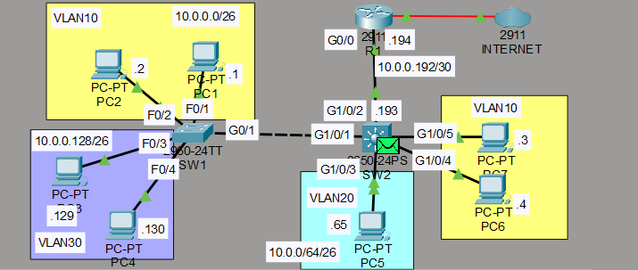
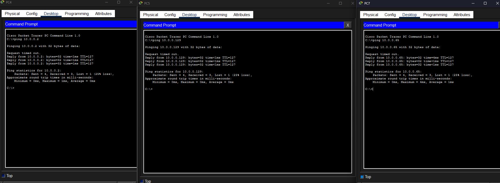
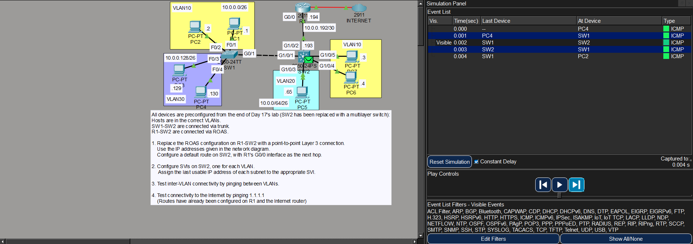

# Laboratorio: Multilayer Switching — Day 18 Lab

## Descripción general

En este laboratorio se reemplaza la configuración de Router-on-a-Stick (ROAS) por un **switch multicapa (Layer 3 switch)** que realiza el enrutamiento entre VLANs mediante **SVIs (Switch Virtual Interfaces)**. El router R1 queda únicamente como salida a internet.

## Topología



La red parte de la configuración final del Day 17, con los siguientes cambios:

- Se eliminan las subinterfaces ROAS en R1
- Se configura un enlace punto a punto entre R1 y SW2 (antes SW2 era un switch capa 2, ahora es un switch multicapa)
- SW2 realiza el enrutamiento inter-VLAN mediante SVIs

## Direccionamiento IP

### Enlace punto a punto (R1 — SW2)

Se utiliza una subred /30.

| Dispositivo | Interfaz | IP            | Máscara          |
| ----------- | -------- | ------------- | ---------------- |
| R1          | g0/0     | 10.0.0.194    | 255.255.255.252  |
| SW2         | g1/0/2   | 10.0.0.193    | 255.255.255.252  |

### SVIs en SW2

Cada VLAN tiene una SVI con la **última dirección útil** de su subred, que servirá como gateway para los hosts.

| VLAN | Subred            | SVI (gateway) |
| ---- | ----------------- | ------------- |
| 10   | 10.0.0.0/26       | 10.0.0.62     |
| 20   | 10.0.0.64/26      | 10.0.0.126    |
| 30   | 10.0.0.128/26     | 10.0.0.190    |

## Configuración de R1

Se eliminan las subinterfaces ROAS y se configura G0/0 como puerto routado con una dirección IP.

```cisco
R1(config)#no int g0/0.10
R1(config)#no int g0/0.20
R1(config)#no int g0/0.30
!
R1(config)#default interface g0/0
R1(config-if)#ip address 10.0.0.194 255.255.255.252
R1(config-if)#no shutdown
```

## Configuración del switch multicapa (SW2)

Se convierte el puerto G1/0/2 en un puerto routado (no switchport), se habilita el enrutamiento IP y se configuran las SVIs.

### Puerto de enlace con R1

```cisco
SW2(config)#default int g1/0/2
SW2(config)#ip routing
SW2(config)#int g1/0/2
SW2(config-if)#no switchport
SW2(config-if)#ip address 10.0.0.193 255.255.255.252
SW2(config-if)#no shutdown
```

### Ruta por defecto

```cisco
SW2(config)#ip route 0.0.0.0 0.0.0.0 10.0.0.194
```

### SVIs para cada VLAN

```cisco
SW2(config)#interface vlan10
SW2(config-if)#ip address 10.0.0.62 255.255.255.192
SW2(config-if)#no shutdown
!
SW2(config-if)#interface vlan20
SW2(config-if)#ip address 10.0.0.126 255.255.255.192
SW2(config-if)#no shutdown
!
SW2(config-if)#interface vlan30
SW2(config-if)#ip address 10.0.0.190 255.255.255.192
SW2(config-if)#no shutdown
```

## Pruebas de conectividad

### Ping entre VLANs

Se verifica que los hosts en diferentes VLANs pueden comunicarse a través del switch multicapa.



### Tráfico hacia internet

Se prueba conectividad con `1.1.1.1`. El tráfico sale de la VLAN, pasa por la SVI de SW2, luego por el enlace punto a punto hacia R1, que lo reenvía hacia el router de internet.



Como se puede observar, el tráfico entre VLANs pasa por el switch multicapa (SW2), no por R1. R1 solo se usa para tráfico hacia internet.

## Resumen de comandos

| Comando                                      | Descripción                                        |
| -------------------------------------------- | -------------------------------------------------- |
| `ip routing`                                 | Habilita el enrutamiento IP en el switch multicapa |
| `no switchport`                              | Convierte un puerto switch en puerto routado       |
| `interface vlan <id>`                        | Crea o accede a una SVI (Switch Virtual Interface) |
| `default interface <interfaz>`               | Restaura una interfaz a su configuración predeterminada |