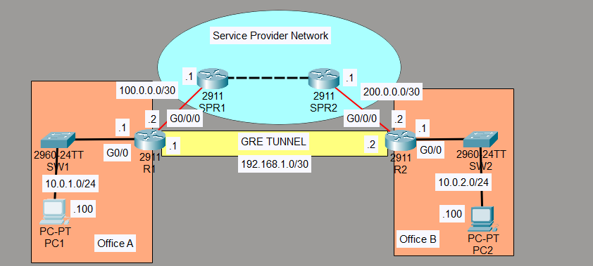
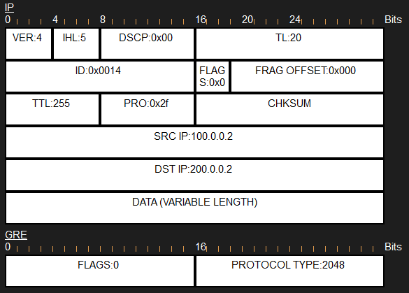
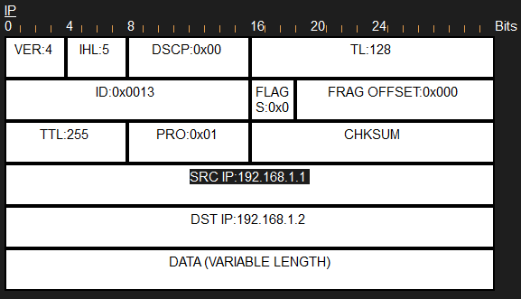
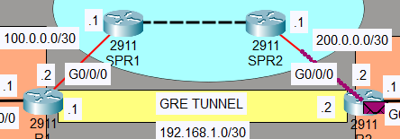
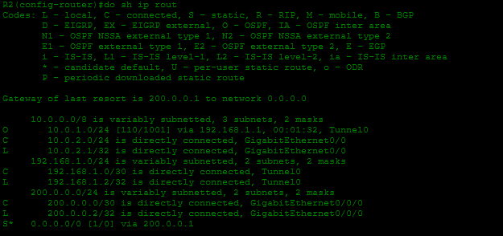
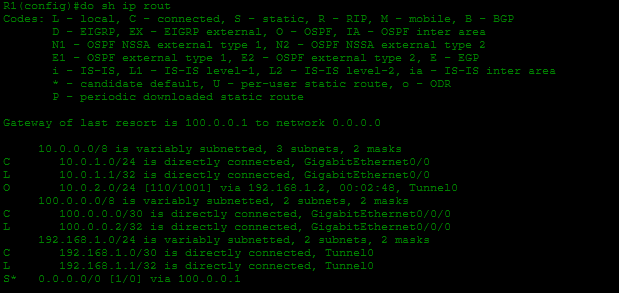
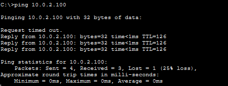

# Laboratorio: GRE Tunnels — Day 53 Lab

## Descripción general

En este laboratorio se crea un túnel **GRE (Generic Routing Encapsulation)** entre R1 y R2. Después se configura OSPF sobre el túnel para que las redes LAN de ambos extremos puedan comunicarse.

## Topología



El túnel GRE utiliza una red virtual `192.168.1.0/30`. Las direcciones públicas de los routers sirven como origen y destino del túnel.

## 1. Configurar el túnel GRE

### R1

```cisco
R1(config)#interface tunnel 0
R1(config-if)#tunnel source g0/0/0
R1(config-if)#tunnel destination 200.0.0.2
R1(config-if)#ip address 192.168.1.1 255.255.255.252
R1(config)#ip route 0.0.0.0 0.0.0.0 100.0.0.1
```

### R2

```cisco
R2(config)#interface tunnel 0
R2(config-if)#tunnel source g0/0/0
R2(config-if)#tunnel destination 100.0.0.2
R2(config-if)#ip address 192.168.1.2 255.255.255.252
R2(config)#ip route 0.0.0.0 0.0.0.0 200.0.0.1
```

## Encapsulación GRE

GRE añade una cabecera GRE y una nueva cabecera IP al paquete original. La nueva cabecera IP contiene las direcciones de los extremos del túnel y permite transportar el paquete a través de la red del ISP.





La cabecera IP exterior se utiliza para transportar físicamente el paquete entre los routers del ISP. La cabecera IP interior conserva las direcciones originales del tráfico entre las LAN.



## 2. Configurar OSPF sobre el túnel

OSPF utiliza la interfaz Tunnel0 para intercambiar información de enrutamiento entre R1 y R2.

### R1

```cisco
R1(config)#router ospf 1
R1(config-router)#network 192.168.1.1 0.0.0.0 area 0
R1(config-router)#network 10.0.1.1 0.0.0.0 area 0
R1(config-router)#passive-interface g0/0
```

### R2

```cisco
R2(config)#router ospf 1
R2(config-router)#network 10.0.2.1 0.0.0.0 area 0
R2(config-router)#network 192.168.1.2 0.0.0.0 area 0
R2(config-router)#passive-interface g0/0
```

Después de establecer la vecindad OSPF, cada router aprende las redes LAN del otro extremo.





## 3. Pruebas de conectividad

Se realizan pings entre PCs de las dos LAN para comprobar que el tráfico atraviesa correctamente el túnel GRE.



## Resumen de comandos

| Comando | Descripción |
| --- | --- |
| `interface tunnel 0` | Crea o accede a la interfaz del túnel GRE. |
| `tunnel source <interfaz>` | Define la interfaz de origen del túnel. |
| `tunnel destination <ip>` | Define la dirección IP del extremo remoto. |
